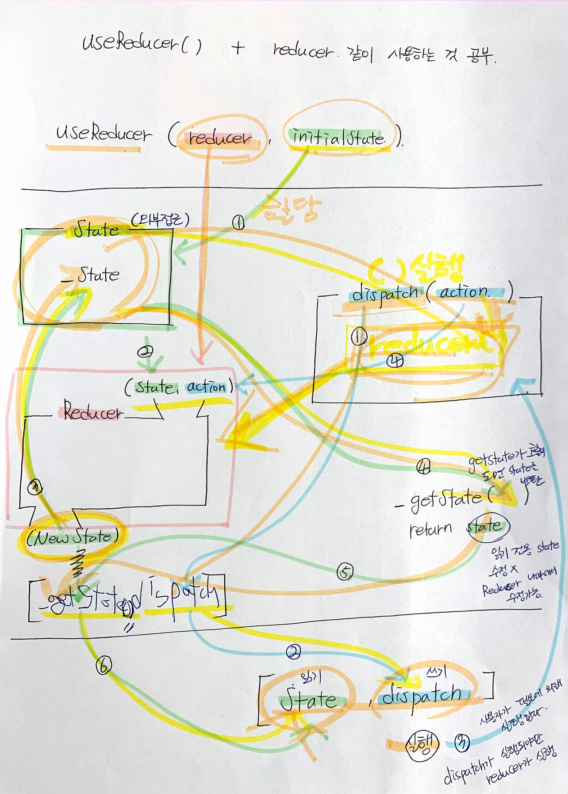

# 학습 주제

3월 23일 학습 시간에 다룰 주제는 다음과 같습니다. 학습 진도를 맞추기 위해 필요한 핵심 개념만 우선 살펴봅니다.

- [x] [React Router](https://reactrouter.com/web/guides/quick-start) (웹)
- [x] [Context](https://ko.reactjs.org/docs/context.html#gatsby-focus-wrapper) API
- [x] [useReducer()](https://ko.reactjs.org/docs/hooks-reference.html#usereducer) 훅

<br>

## 라우터 활용

파이널 프로젝트는 여러 페이지로 구성됩니다. 여러 페이지를 구성하고, 연결, 현재 페이지를 활성화 하는 기본 방법을 학습합니다.

- 싱글 페이지 앱 이해
- 라우팅, 스위치 설정
- 라우트 설정

<br>

### 🎬 나의 영화 서비스

영화 목록 표시 및 상세 정보를 안내 하는 간단한 서비스를 만든다고 가정 해봐요. 그리고 맘에 드는 영화는 
"나의 영화(My Movies)" 북마크 목록에 저장해 읽거나, 수정 혹은 지울 수 있는 기능을 추가하고 싶을 거에요.
'나의 영화"를 기억하기 위해서는 회원가입 또는 로그인이 필요할테고요.


그러기 위해서는 인증(Auth), 데이터베이스(DB)가 필요하지만 아직 배우기 전이니까 오늘은 페이지를 전환하는 기능에 대해 학습해봅시다.
인증, 데이터베이스 활용은 백엔드 개발 영역 담당 개발자가 없으니까 나중에 [Firebase](https://firebase.google.com/?hl=ko) 서비스를 (무료로) 활용해볼거에요.

<br>

### 📑 페이지 별 라우트 구성

"나의 영화" 서비스를 구성할 페이지를 작성하기 전에 어떤 페이지를 만들어야 할 지 생각해야 합니다.

페이지(page) | 라우트(route) | 설명 | 접근 권한 요구
-- | -- | -- | --
`src/pages/Home/Home.js` | `/` | 홈 페이지 | 
`src/pages/SignUp/SignUp.js` | `/signup` | 회원가입 페이지 | 
`src/pages/SignIn/SignIn.js` | `/signin` | 로그인 페이지 | 
`src/pages/Movies/MovieList.js` | `/movies` | 무비 리스트 페이지 | 
`src/pages/Movies/MovieDetail.js` | `/movie/:id` | 무비 상세 페이지 | 
`src/pages/Bookmark/Bookmark.js` | `/bookmark` | 무비 북마크 페이지 | 로그인(인증) 사용자
`src/pages/PageNotFound/PageNotFound.js` | `/page-not-found` | 오류 안내 페이지 | 

<br>

### 🚦 라우터, 스위치, 루트, 리디렉트 컴포넌트 구성

React Router 라이브러리가 제공하는 컴포넌트를 활용해서 브라우저 URL을 분석해 매칭되는 페이지로의 루트(길, route)를 안내할거에요.

```jsx
(
  <Router>
    <Switch>
      {/* URL이 정확히 `/` 군요. "홈" 페이지로 가세요. */}
      <Route path="/" exact>
        <Home />
      </Route>
      {/* URL이 `/movies` 군요. "무비 리스트" 페이지로 가세요. */}
      <Route path="/movies">
        <MovieList />
      </Route>
      {/* URL이 `/movie/301` 이군요. "무비 상세" 페이지로 가세요. */}
      <Route path="/movie/:id">
        <MovieDetail />
      </Route>
      {/* 이런! 매칭되는 URL이 없네요. "오류 안내" 페이지로 가세요. */}
      <Redirect to="/page-not-found" />
    </Switch>
  </Router>
)
```

<br>

## 리듀서 활용

Redux 학습에 앞서 유사한 개념을 useReducer 훅을 학습하며 다뤄봅니다. 상태의 업데이트 흐름에 집중해서 학습합니다.

- 복잡한 상태 관리
- 리듀서 (순수) 함수
- 초기 상태
- 디스패치
- 액션 (객체)



<br>
<br>

## 컨텍스트 활용 (with HOC)

특정 컨텍스트 안에서 상태를 효과적으로 공유하고자 할 때 활용하는 방법을 학습합니다.

- 컨텍스트 사용 목적
- 컨텍스트 생성
- 컨텍스트 공급 (값)
- 컨텍스트 수요 
    - 클래스 컴포넌트: `contextType`
    - 고차 컴포넌트(HOC): `withContext()`
    - 함수 컴포넌트: `useContext()`
- 컨텍스트 모듈 
    - Context
    - ContextProvider
    - Initial State
    - Reducer
    - HOC
    - Custom Hooks
