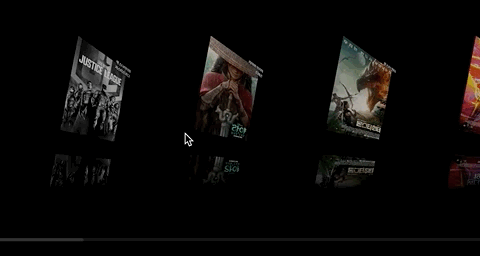

# 트러블 슈팅

지난 실습 자료에서 발생한 문제를 확인하고 해결합니다.

1. [React 버그 가능성 경고](#1-React-버그-가능성-경고)
1. [링크 요소 클릭 문제](#2-링크-요소-클릭-문제)
1. [비디오 자동 재생 문제](#3-비디오-자동-재생-문제)
1. [이미지 로딩 표시 문제](#4-이미지-로딩-표시-문제)

> 파이널 프로젝트를 진행하면 다양한 문제를 마주하게 됩니다. 마주한 문제 원인을 면밀히 분석한 후, 해결하기까지의 과정을 꼼꼼히 기록하는 습관을 가지는 것이 좋습니다. 😄
> 당시에는 문제 원인과 해결 방법을 기억하더라도 훗날 다시 기억하기 어려울 수 있으니까요.

<br>

## 1. React 버그 가능성 경고

실습 자료에 사용된 React Helmet은 현재 적극적으로 관리되지 않아 [문제를 유발할 가능성(`UNSAFE_`)](https://ko.reactjs.org/blog/2018/03/27/update-on-async-rendering.html)이 있습니다.


> react-helmet은 더 이상 사용이 권장되지 않는 `componentWillMount` 라이프 사이클 메서드를 사용하므로 잠재적으로 비동기 렌더링 시에 문제를 
일으킬 가능성이 있음을 React에서 경고합니다. React는 `UNSAFE_` 접두사를 붙여 안전하지 않은 라이프 사이클 메서드가 사용 되고 있음을 알려줍니다.
이러한 경고를 무시할 경우 React의 차기 버전에서 버그를 유발할 가능성이 있습니다.

<br>

이 문제는 [react-helmet-async](https://www.npmjs.com/package/react-helmet-async) 패키지를 설치, 활용해 해결할 수 있습니다.
`react-helmet` 패키지를 제거한 후, 설치합니다. ([참고](https://open.nytimes.com/the-future-of-meta-tag-management-for-modern-react-development-ec26a7dc9183))

**패키지 제거/설치**

```sh
npm un react-helmet
npm i react-helmet-async
```

"나의 영화" 앱을 `react-helmet-async` 패키지의 \<HelmetProvider\> 컴포넌트로 감쌉니다.

**App.js**

```jsx
import { HelmetProvider } from 'react-helmet-async'

function App() {
  return (
    <HelmetProvider>
      <div className="App">
        {/* ... */}
      </div>
    </HelmetProvider>
  )
}
```

Home 페이지 컴포넌트 코드를 아래와 같이 수정합니다. 다른 페이지 컴포넌트에도 동일한 방법을 적용합니다.

**Home.js**

```jsx
import { Helmet } from 'react-helmet-async'

export default function HomePage() {
  return (
    <div className="home-page">
      <Helmet>
        <title>홈 ← "나의 영화" 서비스</title>
      </Helmet>
      {/* ... */}
    </div>
  )
}
```


## 2. 링크 요소 클릭 문제

이 문제는 React 또는 설치된 패키지와 상관 없습니다. 개발 상에서 유발된 문제로 보다 나은 사용자 경험(UX)을 제공하기 위해 필요한 조치입니다.
실습 자료의 홈페이지 ENTER 링크는 마우스로 클릭해 "영화 목록" 페이지로 이동하는데 문제가 있습니다. (클릭 영역이 가려진 문제)


<br>
<br>

React Router를 통해 Home 페이지 컴포넌트에 전달되는 props 중 [history](https://reactrouter.com/web/api/history)를 사용해 해결해보겠습니다.
\<Effects\> (Link) 컴포넌트를 가리고 있는 \ 요소를 \<a\> 요소로 감싼 후, 프로그래밍 방식(`.push()`)으로 "영화 목록" 페이지로
이동할 수 있도록 설정합니다.

```jsx
export default function HomePage({ history }) {
  return (
    <div className="home-page">
      <Helmet>
        <title>홈 ← "나의 영화" 서비스</title>
      </Helmet>
      <Effects message="ENTER" className={effect} />
      <a
        href="#go-to-movies"
        onClick={(e) => {
          e.preventDefault()
          history.push('/movies')
        }}
      >
        
      </a>
    </div>
  )
}
```

문제를 해결하면 사용자가 "영화 목록" 페이지로 이동하는 링크를 클릭하는데 아무런 문제가 발생하지 않습니다.


<br>
<br>

## 3. 비디오 자동 재생 문제

실습 자료에 사용된 Youtube 비디오는 배경으로 활용되며, 자동 재생됩니다. 음소거 처리한 자동 재생이지만,
사용자가 자동 재생되는 영상을 멈출 수 없어 "접근성 문제"입니다. 사용자에 의해 자동 재생을 일시 정지 하거나, 다시 재생할 수 있도록 구현해야 합니다.

가장 좋은 방법은 UI에 재생/일시정지 할 수 있는 버튼을 제공하는 것입니다. 차선책으로는 영상을 멈추거나, 재생할 수 있는 단축키를 제공할 수 있습니다.
프로젝트 오픈이 임박한 상황이라 우선 단축키를 제공하고, 추후에 재생/일시정지 버튼을 제공한다고 가정해봅시다.

단축키를 제공하기 위해 YouTubePlayer 컴포넌트 코드를 다소 수정하였습니다. 실제 DOM에 렌더링 된 Youtube 플레이어에 접근하기 위해서는
`useRef`, `useEffect` 훅을 사용해야 합니다. 그리고 단축키를 등록하는 이벤트, 이벤트 리스너를 정의해야 합니다.

> 이벤트 리스너를 등록했으니, 컴포넌트 언마운트 이후 문제가 생기지 않도록 등록 해제하는 것을 잊지마세요!

```jsx
// Youtube 참조 객체 생성
const youtubeRef = React.useRef(null)

React.useEffect(() => {
  // YoutubeRef 참조 객체의 getInternalPlayer() 메서드를 실행해 플레이어 요소 참조
  const player = youtubeRef.current.getInternalPlayer()

  // 재생/일시정지 단축키 이벤트 리스너
  const handleKeyUp = (e) => {
    const code = e.keyCode

    if (code === 27 /* Escape */) {
      player.pauseVideo()
    }
    if (code === 32 /* Space */ || code === 13 /* Enter */) {
      player.playVideo()
    }
  }

  // 이벤트 리스너 등록
  window.addEventListener('keyup', handleKeyUp)

  // 클린업
  return () => {
    // 이벤트 리스너 등록 해제
    window.removeEventListener('keyup', handleKeyUp)
  }
}, [])
```

작성된 YoutubePlayer 컴포넌트 코드는 components 디렉토리 안에 있습니다.

```sh
src/components/YoutubePlayer/
               ├── YoutubePlayer.js
               └── YoutubePlayer.module.scss
```

<br>

## 4. 이미지 로딩 표시 문제

웹은 설치형 앱과 달리, 서버로부터 리소스를 다운로드 받아 해석하여 UI를 렌더링하기 때문에 상대적으로 느리게 느껴집니다. 그렇기 때문에 사용자가 체감상 느리게 느끼지 않도록 성능을 최적화하려는 노력이 필요합니다. 가장 일반적인 렌더링 최적화 방법은 **리소스 크기를 최소화** 하는 것입니다. 그리고 **가능한 경우 리소스의 사용이 가능한 시점까지 표시를 지연시키고 로딩 중임을 표시**해야 합니다. 

웹에서 사용하는 리소스들 중 크기에 가장 영향을 주는 것은 아무래도 이미지입니다. 이미지 최적화 기술을 사용해 최대한 이미지 크기를 줄이더라도 **이미지 개수가 많아지면 로딩 시간이 길어지는 문제는 피해갈 수 없습니다.** 이러한 문제를 해결하기 위해서는 사용자에게 바로 표시되는 영역 ([ATF](https://www.wordstream.com/below-the-fold))만 우선 로딩 표시하고, 나머지 감춰진 영역(BTF)은 사용자에게 표시되는 시점에 로딩하는 지연된 로딩 (lazy loading) 처리가 필요합니다.

<br>


<br>
<br>

작성된 실습 예제는 이미지 리소스 지연 로딩 처리를 하지 않아 사용자가 감춰진 영역을 보고자 할 때 일시적으로 아무 것도 보여주지 않습니다.



<br>
<br>

이 문제는 지연된 로딩 이미지 컴포넌트 LazyLoadingImg를 만들어 해결할 수 있습니다. LazyLoadingImg 컴포넌트는 이미지를 로딩 시도할 때 
사용자에게 표시할 플레이스홀더(placeholder) 이미지를 표시한 후, 이 곳에 이미지가 들어올 것임을 사용자에게 안내합니다.


<br>
<br>

이미지의 지연된 로딩 처리를 위해 [Intersection Observer API](https://developer.mozilla.org/ko/docs/Web/API/Intersection_Observer_API)를 활용했습니다.
이 API는 목표 요소와 상위 요소 또는 최상위 `document`의 뷰포트(viewport) 사이 교차(intersection) 변화를 비동기적으로 관찰하는 방법을 제공합니다.
즉, 지정된 영역에 대해 교차(intersection) 했는 지 여부를 감지하고 해당 시점에 원하는 작업을 수행할 수 있도록 합니다.

> Intersection Observer API IE에서 지원하지 않습니다.  
> 하지만 폴리필을 사용하면 IE 7+ 지원이 가능합니다. [IntersectionObserver polyfill](https://bit.ly/3vQhMKp)

<br>

인터섹션 옵저버(intersection observer)를 생성하기 위해서는 생성자 호출 시, "콜백 함수"를 제공해야 합니다. 
이 콜백 함수는 `threshold`가 한 방향 혹은 다른 방향으로 교차할 때 실행됩니다.

```jsx
// 인터섹션 옵저버 객체 생성
new IntersectionObserver(
  // 교차가 감지되면 실행될 콜백 함수
  onIntersection, 
  {
    // 이미지 로딩이 80% 이상 진행되면 표시
    threshold: 0.8,
  }
)
```

```jsx
// 옵저버를 참조할 변수
let observer = null

// 커스텀 이벤트 이름
const LAZY_LOAD_IMG = 'lazyLoadImg'

// 교차가 감지되면 실행 될 콜백 함수
function onIntersection(intersectionObserverEntry, intersectionObserver) {
  intersectionObserverEntry.forEach((entry) => {
    // 지정된 영역에 교차가 감지된 경우
    if (intersectionObserverEntry.isIntersecting) {
      const target = intersectionObserverEntry.target
      intersectionObserver.unobserve(target)
      // 커스텀 이벤트 디스패치
      target.dispatchEvent(new CustomEvent(LAZY_LOAD_IMG))
    }
  })
}
```

LazyLoadingImg 컴포넌트는 이미지 요소의 필수 속성인 `src`, `alt` 그리고 사용자 정의 클래스 설정이 선택적으로 가능하도록 `className`을 props로 설정합니다.
이미지 노드의 로딩 여부는 DOM에 마운트(mount) 한 이후 처리되어야 하므로 `useRef`, `useEffect` 훅을 사용해야 합니다. 그리고 로딩 상태 여부는 `useState` 훅을 활용합니다.
자세한 개별 설정은 작성된 주석을 참고하세요.

```jsx
function LazyLoadingImg({
  src,
  alt = '',
  className = '',
  placeholderImage = PLACEHOLDER_IMAGE,
  ...restProps
}) {
  // 이미지 노드를 참조하기 위한 useRef 훅
  const imgRef = React.useRef(null)
  // 이미지 로딩 상태를 처리하기 위한 상태
  const [isLoaded, setIsLoaded] = React.useState(false)

  React.useEffect(() => {
    // 이미지 요소 노드 참조
    const imgNode = imgRef.current
    // 이벤트 리스너
    // 커스텀 이벤트 LASY_LOAD_IMG가 호출되면 콜백 실행
    const handleLazyLoadingImg = () => setIsLoaded(true)

    // 이미지 노드가 있을 경우, 커스텀 이벤트 LASY_LOAD_IMG 이벤트 ← 이벤트 리스너 연결
    imgNode && imgNode.addEventListener(LAZY_LOAD_IMG, handleLazyLoadingImg)

    // 클린업
    return () => {
      // 이미지 노드가 있을 경우, 커스텀 이벤트 LASY_LOAD_IMG 이벤트 연결 해제
      imgNode &&
        imgNode.removeEventListener(LAZY_LOAD_IMG, handleLazyLoadingImg)
    }
  }, [])

  React.useEffect(() => {
    // 인터색션 옵저버가 존재하지 않은 경우
    if (!observer) {
      // 인터섹션 옵저버 객체 생성
      observer = new IntersectionObserver(onIntersection, {
        // 이미지 로딩이 80% 이상 진행되면 표시
        threshold: 0.8,
      })
    }

    // 이미지 요소를 옵저버 객체를 통해 교차 여부 감시 설정
    imgRef.current && observer.observe(imgRef.current)
  }, [])

  return (
    
  )
}
```

작성된 LazyLoadingImg 컴포넌트 코드는 components 디렉토리 안에 있습니다.

```sh
src/components/LazyLoadingImg/
               ├── LazyLoadingImg.js
               └── LazyLoadingImg.module.scss
```

> 직접 구현하지 않고, [react-lazy-load-image-component](https://www.npmjs.com/package/react-lazy-load-image-component) 패키지를 설치해 활용할 수도 있습니다.

<br>

# 학습 주제

3월 25일 학습 시간에 다룰 주제는 다음과 같습니다. 학습 진도를 맞추기 위해 필요한 핵심 개념만 우선 살펴봅니다.

- [x] React Router 내비게이션 링크. 그리고 현재 페이지 활성화
- [x] [useReducer()](https://ko.reactjs.org/docs/hooks-reference.html#usereducer) 훅 활용
- [x] [Context](https://ko.reactjs.org/docs/context.html#gatsby-focus-wrapper) API 활용

<br>

## React Router 내비게이션 링크 & 활성화

이전 시간에서 다룬 라우팅 설정에 이어 현재 페이지 활성화를 처리하는 방법을 실습합니다.

1. [내비게이션 링크(NavLink)](https://reactrouter.com/web/api/NavLink) 컴포넌트 활용
1. **movies**, **bookmark** 페이지에서 각 내비게이션 링크 활성화 처리
1. 공식 문서의 `activeClassName`, `activeStyle` 속성 설정
1. 공식 문서에서 안내하는 `isActive` 속성 설정. 하지만 결과는?
1. React Router가 제공하는 `location`을 활용해 **movies**, **movie:id** 페이지에서 모두 활성화 처리
1. **movies** 페이지의 **movie:id** 페이지로 이동하는 \<a\> 요소를 \<Link\> 컴포너트로 변경

<br>

## 리듀서 활용

지난 시간에 리듀서 함수 그리고 useReducer 훅을 활용하는 방법을 진행하다 수업이 마무리 되었습니다. 진행 내용을 되새겨 봅니다.

```jsx
/* -------------------------------------------------------------------------- *
 * 리듀서 훅 활용 편
 * -------------------------------------------------------------------------- *
 * const [state, dispatch] = React.useReducer(reducer, intialArg, init?)
 * 사용자가 dispatch() 실행할 때 전달하는 액션(JS 객체 { type, payload?, .. })
 */

// 북마크 초깃값
const initialBookmark = []

// 북마크 리듀서 (순수) 함수
function bookmarkReducer(state, action) {
  switch (action.type) {
    case 'create':
      return [...state, action.payload]
    
    case 'update':
      return state.map((bookmark) => {
        return bookmark.id === action.payload.id
          ? action.payload
          : bookmark
      })
    
    case 'delete':
      return state.filter(({ id }) => id !== action.payload.id)
    
    // 북마크 리듀서에서 상태를 다른 유형으로 변형을 가하면 안되므로 읽기(read)는 제외 합니다.
    // 읽기를 시도할 경우, 현재 상태를 그대로 반환하도록 설정합니다.
    case 'read':
    default:
      return state
  }
}
```

```jsx
// 사용자가 북마크(❤️) 버튼을 누르면 `쓰기(create)`를 요청(알림)
// dispatch({type: create, payload: newBookmark})
// dispatch({type: 'read', payload: newBookmark.id})
```

<br>

### [미션 1] 영화 정보 페이로드 확인

비동기 통신에 성공(resolved)하면 응답 받은 영화 정보(json)를 북마크 리스트 상태(`[]`)에 추가(create) 해봅니다.
새로운 상태를 추가하기 위해서는 useReducer 훅이 반환한 `dispatch`를 활용해야 합니다. 디스패치 과정에서 
사용자가 요구하는 액션(객체)을 전달하면, 디스패치는 북마크 리듀서 함수를 실행해 상태를 업데이트 합니다.

비동기 통신 성공 시점에 `json`이 존재할 경우, 북마크(객체)는 다음의 속성을 가지는 객체여야 합니다.

```jsx
{
  id,
  title,
  tagline,
  overview,
  poster,
  homepage,
}
```

추출한 영화 정보를 토대로 저장할 북마크(객체)를 작성해 액션 정보(객체)를 작성한 후, 디스패치하여 북마크 리듀서가 실행되도록 코드를 작성해보세요.
그러면 리듀서 함수가 북마크 리스트 상태를 업데이트 할 것이고, 상태가 업데이트 되면 `state` 값이 바뀔 것입니다. 

```jsx
// state 업데이트 결과는 출력을 통해 확인
console.log(state)
```


<br>

### [미션 2] 북마크 버튼 컴포넌트

[FontAwesome for React](https://yamoo9.gitbook.io/learning-react-app/tip-and-references/font-awesome-for-react) 글을 참고해 
하트(❤️) 아이콘을 포함하는 BookmarkButton 컴포넌트를 만들어 봅니다. (아래 코드 참고)

```jsx
<BookmarkButton
  label="북마크"
  isActive={checkBookmark}
  disabled={checkBookmark}
  onClick={() => setCheckBookmark(true)}
  className={button}
  iconProps={{ size: '2x' }}
/>
```

북마크 버튼 활성 상태의 레이블은 "북마크 제거", 그리고 비활성 상태의 레이블은 "북마크 추가"여야 합니다.


### [미션 3-1] 북마크 기능 추가 (토글 안됨)

BookmarkButton 버튼 컴포넌트를 사용자가 클릭하면 영화 정보를 북마크 하는 기능을 추가해봅니다.
사용자가 북마크 버튼을 클릭하면 `state`에 북마크 객체가 추가 되어야 합니다. 단, 한 번 추가하면 제거할 수 없도록 설정하세요.


### [미션 3-2] 북마크 기능 추가/제거 (토글 가능)

BookmarkButton 버튼 컴포넌트를 사용자가 클릭해 영화 정보를 북마크 추가 또는 제거할 수 있도록 코드를 변경합니다.


<br>

### 상태 관리 문제

사용자가 요구한 북마크 추가/제거 기능은 문제없이 작동하나, 북마크 정보를 저장한 상태가 "영화 정보" 페이지에서만 사용 가능합니다.
로그인(인증) 사용자인 경우 북마크 페이지로 이동해 자신이 추가한 북마크를 확인할 수 있어야 하는데 말이죠.


이 문제는 "상태 끌어올리기"를 사용해 App 컴포넌트에서 북마크 상태를 관리하여 해결할 수도 있지만... 향후 페이지 구조가 복잡해진다면?
상태 관리는 또 다시 곤란해질 것입니다. 이어서 컨텍스트 API를 학습한 후, 상태 관리 문제를 해결해봅시다. 😄

<br>

## 컨텍스트 활용

특정 컨텍스트 안에서 상태를 효과적으로 공유하고자 할 때 활용하는 [Context API](https://ko.reactjs.org/docs/context.html)를 학습합니다.

- 컨텍스트 사용 목적
- 컨텍스트 생성
- 컨텍스트 공급 (값)
- 컨텍스트 수요 
    - 클래스 컴포넌트: `contextType`
    - 고차 컴포넌트(HOC): `withContext()`
    - 함수 컴포넌트: `useContext()`

<br>

## 북마크 컨텍스트 모듈

북마크를 관리하는 컨텍스트 모듈을 작성합니다.

### [미션 1] 북마크 컨텍스트 & 컨텍스트 프로바이더 래퍼 컴포넌트

"컨텍스트 객체" 생성, "컨텍스트 프로바이더"를 감싸는 래퍼 컴포넌트를 작성해봅니다.

유형 | 설명
-- | --
Context | 컨텍스트 객체
ContextProvider | 생성된 컨텍스트 프로바이더 래퍼 컴포넌트

<br>

BookmarkProvider 컴포넌트는 App 컴포넌트 안에 렌더링 되는 `div.App`을 래핑할 수 있어야 합니다.

```jsx
import { BookmarkProvider } from 'contexts'


function App() {
  return (
    <HelmetProvider>
      <BookmarkProvider>
        <div className="App">
          {/* ... */}
        </div>
      </BookmarkProvider>
    </HelmetProvider>
  )
}
```

React 개발 도구에서 래퍼 컴포넌트가 요구되는 대로 `children`을 감싸는 지 확인하세요.


<br>
<br>

### [미션 2] 북마크 상태 관리 구성

북마크 컨텍스트 안에서 상태를 관리하기 위한 준비가 필요합니다. 앞서 학습한 리듀서, 액션 타입/크리에이터 등을 작성합니다.

유형 | 설명
-- | --
Initial Bookmark State | 북마크 상태 초깃값 
Bookmark Reducer | 북마크 리듀서
Action Types | 북마크 액션 타입(상수)
Action Creator | 북마크 액션 크리에이터(액션 객체 생성)

<br>

BookmarkProvider 래퍼 컴포넌트 안에서 `useReducer` 훅을 사용해 북마크 관리에 필요한 `state`, `dispatch`를 추출해
북마크 컨텍스트 값(value)으로 공급해야 합니다.

```jsx
// 북마크 컨텍스트 프로바이더 래퍼 컴포넌트 내보내기
export const BookmarkProvider = (props) => {
  // useReducer 훅을 사용해 state, dispatch 추출
  const [state, dispatch] = React.useReducer(bookmarkReducer, initialBookmark)

  const provideValue = { /* 공급할 값을 여기에 구성합니다. */ }

  return <BookmarkContext.Provider value={provideValue} {...props} />
}
```

<br>

### [미션 3] 고차 컴포넌트와 커스텀 훅 작성 

`context` props로 컨텍스트 값을 전달하는 `withBookmark` 고차 컴포넌트,
컨텍스트 값을 반환하는 `useBookmark` 커스텀 훅을 작성해봅니다.

유형 | 설명
-- | --
withBookmark | 북마크 고차 컴포넌트(HOC) (컨텍스트 값을 `context` props로 제공)
useBookmark | 북마크 커스텀 훅 (컨텍스트 값을 반환하는 함수, 함수 컴포넌트에서만 사용)

<br>

작성된 고차 컴포넌트, 커스텀 훅은 모두 "이름 내보내기"로 내보냅니다.

```jsx
// 고차 컴포넌트
export const withBookamark = (Comp) => { /* ... */ }

// 커스텀 훅
export const useBookmark = () => { /* ... */ }
```

<br>

### [미션 4-1] 컨텍스트 모듈 활용

"영화 정보" 페이지에 작성되었던 `useReducer` 훅, 리듀서, 초깃값을 모두 제거합니다.
북마크 컨텍스트 모듈로부터 `useBookmark` 커스텀 후, `addBookmarkAction` 액션 크리에이터를 불러와
컨텍스트 값을 업데이트 할 수 있도록 코드를 작성합니다.

```jsx
import { useBookmark, addBookmarkAction } from 'contexts/Bookmark'
```

사용자가 북마크 추가 버튼을 누르면 북마크 컨텍스트의 상태(`state`) 값이 업데이트 되어야 합니다.


### [미션 4-2] 페이지 전환에도 상태 유지

북마크 추가 후, 북마크 페이지로 이동해도 저장된 북마크 상태가 유지되어야 합니다.

