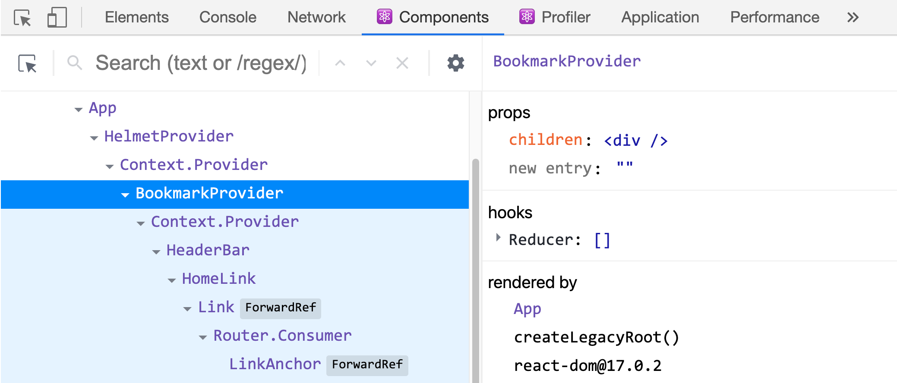
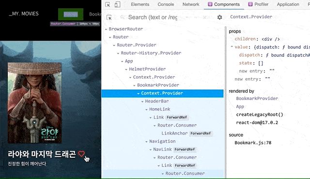
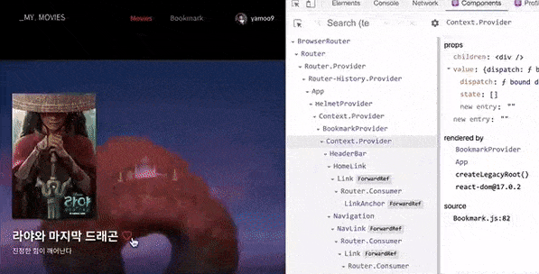
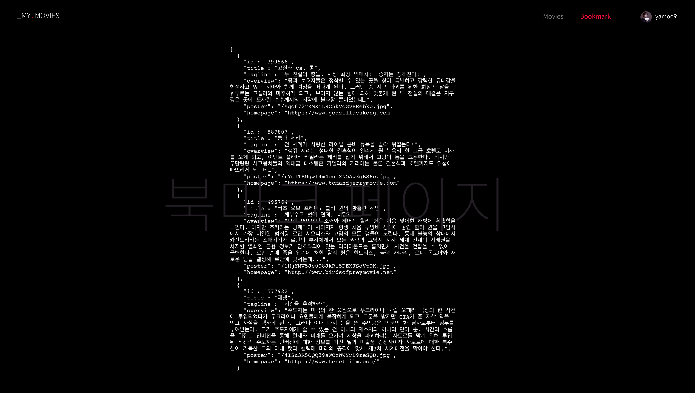
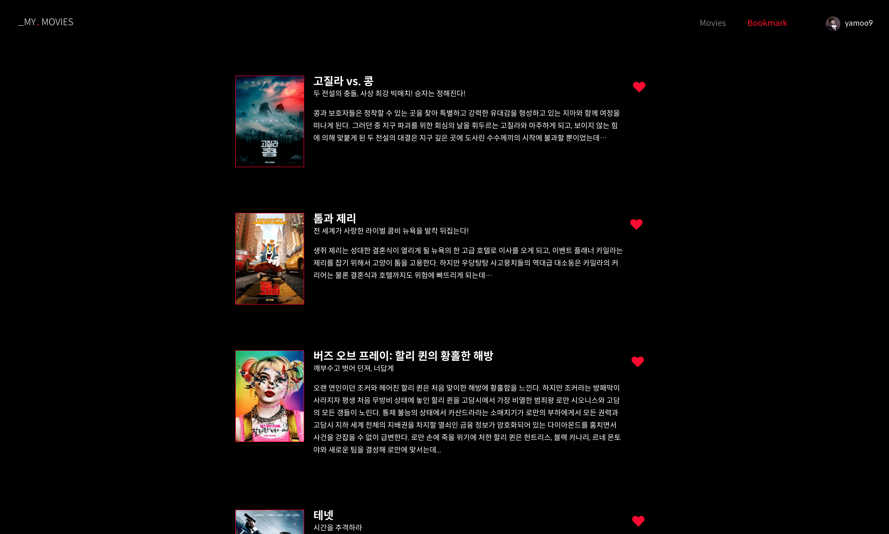
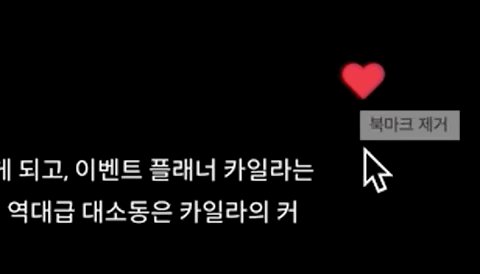
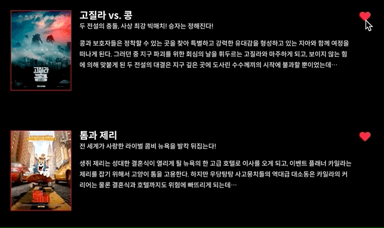
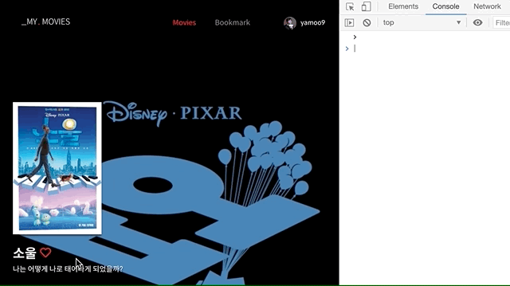
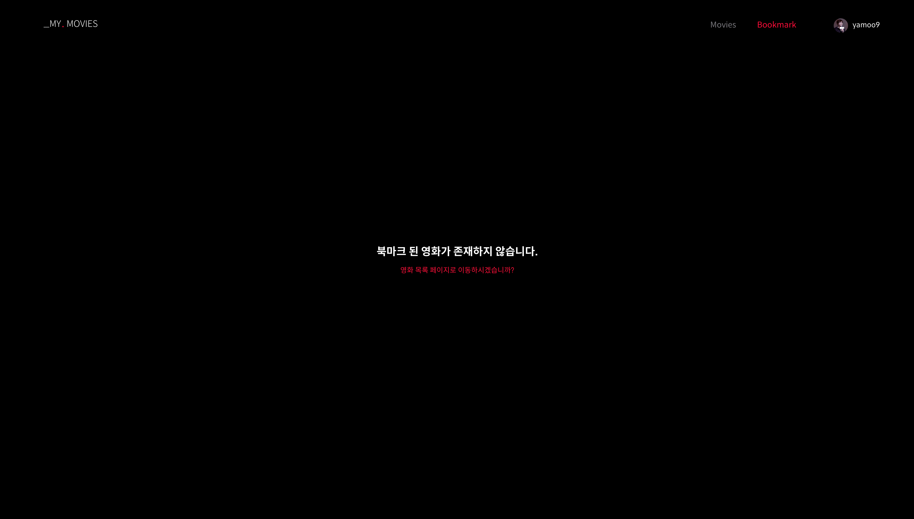

# 학습 주제

3월 26일 학습 시간에 다룰 주제입니다.

- [x] [Context](https://ko.reactjs.org/docs/context.html#gatsby-focus-wrapper) API 활용
- [x] 북마크 컨텍스트(BookmarkContext) 모듈을 사용해 앱에서의 북마크 상태 관리
- [x] 북마크 페이지 → 북마크 리스트 제공 (유틸리티 함수, [Styled Components](https://styled-components.com/) 활용, 마이크로 인터랙션)
- [x] 헤더바 → 회원가입/로그인 | 로그아웃/프로필 조건부 렌더링
- [x] 인증 컨텍스트 모듈 활용
<!-- - [x] Firebase 컨텍스트(FirebaseContext) 모듈 → 인증 상태 관리 -->

<br>

## Context API

특정 컨텍스트 안에서 상태를 효과적으로 공유하고자 할 때 활용하는 [Context API](https://ko.reactjs.org/docs/context.html)를 학습합니다.

- 컨텍스트 사용 목적
- 컨텍스트 생성
- 컨텍스트 공급 (값)
- 컨텍스트 수요 
    - 클래스 컴포넌트: `contextType`
    - 고차 컴포넌트(HOC): `withContext()`
    - 함수 컴포넌트: `useContext()`

<br>

## 북마크 컨텍스트 모듈

북마크를 관리하는 컨텍스트 모듈을 작성합니다.

### [미션 1] 북마크 컨텍스트 & 컨텍스트 프로바이더 래퍼 컴포넌트

"컨텍스트 객체" 생성, "컨텍스트 프로바이더"를 감싸는 래퍼 컴포넌트를 작성해봅니다.

유형 | 설명
-- | --
Context | 컨텍스트 객체
ContextProvider | 생성된 컨텍스트 프로바이더 래퍼 컴포넌트

<br>

BookmarkProvider 컴포넌트는 App 컴포넌트 안에 렌더링 되는 `div.App`을 래핑할 수 있어야 합니다.

```jsx
import { BookmarkProvider } from 'contexts'


function App() {
  return (
    <HelmetProvider>
      <BookmarkProvider>
        <div className="App">
          {/* ... */}
        </div>
      </BookmarkProvider>
    </HelmetProvider>
  )
}
```

React 개발 도구에서 래퍼 컴포넌트가 요구되는 대로 `children`을 감싸는 지 확인하세요.



<br>
<br>

### [미션 2] 북마크 상태 관리 구성

북마크 컨텍스트 안에서 상태를 관리하기 위한 준비가 필요합니다. 앞서 학습한 리듀서, 액션 타입/크리에이터 등을 작성합니다.

유형 | 설명
-- | --
Initial Bookmark State | 북마크 상태 초깃값 
Bookmark Reducer | 북마크 리듀서
Action Types | 북마크 액션 타입(상수)
Action Creator | 북마크 액션 크리에이터(액션 객체 생성)

<br>

BookmarkProvider 래퍼 컴포넌트 안에서 `useReducer` 훅을 사용해 북마크 관리에 필요한 `state`, `dispatch`를 추출해
북마크 컨텍스트 값(value)으로 공급해야 합니다.

```jsx
// 북마크 컨텍스트 프로바이더 래퍼 컴포넌트 내보내기
export const BookmarkProvider = (props) => {
  // useReducer 훅을 사용해 state, dispatch 추출
  const [state, dispatch] = React.useReducer(bookmarkReducer, initialBookmark)

  const provideValue = { /* 공급할 값을 여기에 구성합니다. */ }

  return <BookmarkContext.Provider value={provideValue} {...props} />
}
```

<br>

### [미션 3] 고차 컴포넌트와 커스텀 훅 작성 

`context` props로 컨텍스트 값을 전달하는 `withBookmark` 고차 컴포넌트,
컨텍스트 값을 반환하는 `useBookmark` 커스텀 훅을 작성해봅니다.

유형 | 설명
-- | --
withBookmark | 북마크 고차 컴포넌트(HOC) (컨텍스트 값을 `context` props로 제공)
useBookmark | 북마크 커스텀 훅 (컨텍스트 값을 반환하는 함수, 함수 컴포넌트에서만 사용)

<br>

작성된 고차 컴포넌트, 커스텀 훅은 모두 "이름 내보내기"로 내보냅니다.

```jsx
// 고차 컴포넌트
export const withBookamark = (Comp) => { /* ... */ }

// 커스텀 훅
export const useBookmark = () => { /* ... */ }
```

<br>

### [미션 4-1] 컨텍스트 모듈 활용

"영화 정보" 페이지에 작성되었던 `useReducer` 훅, 리듀서, 초깃값을 모두 제거합니다.
북마크 컨텍스트 모듈로부터 `useBookmark` 커스텀 후, `addBookmarkAction` 액션 크리에이터를 불러와
컨텍스트 값을 업데이트 할 수 있도록 코드를 작성합니다.

```jsx
import { useBookmark, addBookmarkAction } from 'contexts/Bookmark'
```

사용자가 북마크 추가 버튼을 누르면 북마크 컨텍스트의 상태(`state`) 값이 업데이트 되어야 합니다.



### [미션 4-2] 페이지 전환에도 상태 유지

북마크 추가 후, 북마크 페이지로 이동해도 저장된 북마크 상태가 유지되어야 합니다.



북마크 컨텍스트에서 내보낸 모든 북마크를 읽는 액션 크리에이터를 불러와 페이지 컴포넌트가 마운트 된 이후에 디스패치 합니다.

```jsx
import { useBookmark, readAllBookmarkAction } from 'contexts'


export default function BookmarkPage(props) {

  const { state, dispatch } = useBookmark()
  
  React.useEffect(
    () => dispatch(readAllBookmarkAction()), 
    []
  )

  // ...
}
```

### [미션 4-3] 유틸리티 활용

페이지 컴포넌트를 포함해 앱의 모든 영역에서 재사용 할 수 있도록 `src/utils/index.js` 파일에 `serialize`, `deserialize` 유틸리티 함수를 추가해보세요.

```jsx
import { serialize } from 'utils'

// ...

<pre style={{ width: 640, margin: '100px auto', whiteSpace: 'pre-wrap' }}>
  {serialize(state, null, 2)}
</pre>
```



### [미션 4-4] 스타일 컴포넌트 활용

앞서 작성한 \<pre\> 요소 코드를 재사용한다는 가정 하에 JSON 코드를 UI에 표시하는 **DisplayJsonCode**를 스타일 컴포넌트로 작성해봅니다.

**패키지 설치**

```sh
npm i -D styled-components
```

**컴포넌트 작성**

[Styled Components 기본 사용법](https://xn--xy1bk56a.run/react-master/lecture/sc-tagged-template-literal.html)을 참고하여 
컴포넌트를 작성하세요.


```jsx
// components/DisplayJsonCode/DisplayJsonCode.js

import styled from 'styled-components'

/* ------------------------------------- */

const DisplayJsonCode = styled.pre`
  /* CSS 코드 */
`
```

**컴포넌트 활용**

DisplayJsonCode 스타일 컴포넌트를 활용해 이전의 \<pre\> 코드를 다음과 같이 개선할 수 있습니다.

```jsx
import { DisplayJsonCode } from 'components'

(
  <DisplayJsonCode>{serialize(state, null, 2)}</DisplayJsonCode>
)
```

<br>

### [미션 5] 북마크 리스트

북마크 리스트 상태를 순환해 북마크 페이지에 리스트 렌더링 합니다.

<br>

#### [미션 5-1] 더미 데이터

현재 시점에서 작성할 때는 북마크 리스트가 빈 상태이므로 아래 작성된 [더미(dummy)](https://ko.wikipedia.org/wiki/%EB%8D%94%EB%AF%B8_%EB%8D%B0%EC%9D%B4%ED%84%B0) 북마크 리스트를 통해 UI를 구현해봅니다.

```jsx
// 더미 북마크 리스트
const [state, setState] = [
  {
    id: '399566',
    title: '고질라 vs. 콩',
    tagline: '두 전설의 충돌, 사상 최강 빅매치!  승자는 정해진다!',
    overview:
      '콩과 보호자들은 정착할 수 있는 곳을 찾아 특별하고 강력한 유대감을 형성하고 있는 지아와 함께 여정을 떠나게 된다. 그러던 중 지구 파괴를 위한 회심의 날을 휘두르는 고질라와 마주하게 되고, 보이지 않는 힘에 의해 맞붙게 된 두 전설의 대결은 지구 깊은 곳에 도사린 수수께끼의 시작에 불과할 뿐이었는데…',
    poster: '/sqo672rKMXiLRC5kVcGvBRebkp.jpg',
    homepage: 'https://www.godzillavskong.com',
  },
  {
    id: '587807',
    title: '톰과 제리',
    tagline: '전 세계가 사랑한 라이벌 콤비 뉴욕을 발칵 뒤집는다!',
    overview:
      '생쥐 제리는 성대한 결혼식이 열리게 될 뉴욕의 한 고급 호텔로 이사를 오게 되고, 이벤트 플래너 카일라는 제리를 잡기 위해서 고양이 톰을 고용한다. 하지만 우당탕탕 사고뭉치들의 역대급 대소동은 카일라의 커리어는 물론 결혼식과 호텔까지도 위험에 빠뜨리게 되는데…',
    poster: '/rYoITBMgw14m4cucXNOAw3qBS6c.jpg',
    homepage: 'https://www.tomandjerrymovie.com',
  },
  {
    id: '495764',
    title: '버즈 오브 프레이: 할리 퀸의 황홀한 해방',
    tagline: '깨부수고 벗어 던져, 너답게',
    overview:
      '오랜 연인이던 조커와 헤어진 할리 퀸은 처음 맞이한 해방에 황홀함을 느낀다. 하지만 조커라는 방패막이 사라지자 평생 처음 무방비 상태에 놓인 할리 퀸을 고담시에서 가장 비열한 범죄왕 로만 시오니스와 고담의 모든 갱들이 노린다. 통제 불능의 상태에서 카산드라라는 소매치기가 로만의 부하에게서 모든 권력과 고담시 지하 세계 전체의 지배권을 차지할 열쇠인 금융 정보가 암호화되어 있는 다이아몬드를 훔치면서 사건을 걷잡을 수 없이 급변한다. 로만 손에 죽을 위기에 처한 할리 퀸은 헌트리스, 블랙 카나리, 르네 몬토야와 새로운 팀을 결성해 로만에 맞서는데...',
    poster: '/1HjYMW5Je0D8JkRl5DEXJSdVtDK.jpg',
    homepage: 'http://www.birdsofpreymovie.net',
  },
  {
    id: '577922',
    title: '테넷',
    tagline: '시간을 추격하라',
    overview:
      '주도자는 미국의 한 요원으로 우크라이나 국립 오페라 극장의 한 사건에 투입되었다가 우크라이나 요원들에게 붙잡히게 되고 고문을 받지만 CIA가 준 자살 약을 먹고 자살을 택하게 된다. 그러나 이내 다시 눈을 뜬 주인공은 의문의 한 남자로부터 임무를 부여받는다. 그가 주도자에게 줄 수 있는 건 하나의 제스처와 하나의 단어 뿐. 시간의 흐름을 뒤집는 인버전을 통해 현재와 미래를 오가며 세상을 파괴하려는 사토르를 막기 위해 투입된 작전의 주도자는 인버전에 대한 정보를 가진 닐과 미술품 감정사이자 사토르에 대한 복수심이 가득한 그의 아내 캣과 협력해 미래의 공격에 맞서 제3차 세계대전을 막아야 한다.',
    poster: '/4ISu3R5OQQ39aWCzWWYrB9reSQD.jpg',
    homepage: 'https://www.tenetfilm.com/',
  },
]
```

<br>

#### [미션 5-2] 스타일 컴포넌트

북마크 리스트를 컴파운드 컴포넌트(Compund component) 패턴을 활용해 스타일 컴포넌트로 작성해보세요.

```jsx
import Bookmark from 'components/BookmarkList/BookmarkList.styled'


(
  <Bookmark.List>
    {state.map(({ id, poster, title, tagline, overview, homepage }) => {
      return (
        <Bookmark key={id}>
          <Bookmark.HomepageLink href={homepage} external>
            <Bookmark.Poster src={tmdb.getImageURL(poster)} alt="" />
          </Bookmark.HomepageLink>
          <Bookmark.Container>
            <Bookmark.Container column>
              <Bookmark.Title>{title}</Bookmark.Title>
              <Bookmark.Tagline>{tagline}</Bookmark.Tagline>
            </Bookmark.Container>
            <Bookmark.Button isActive={true} iconProps={{ size: '2x' }} />
          </Bookmark.Container>
          <Bookmark.Overview>{overview}</Bookmark.Overview>
        </Bookmark>
      )
    })}
  </Bookmark.List>
)
```

<br>

북마크 JSON 데이터의 각 속성에 매칭되는 컴포넌트 구성을 참고하세요.

JSON 값 | 컴포넌트
--- | ---
`id` | ·
`poster` | \<Bookmark.Poster /\>
`title` | \<Bookmark.Title /\>
`tagline` | \<Bookmark.Tagline /\>
`overview` | \<Bookmark.Overview /\>
`homepage` | \<Bookmark.HomepageLink /\>

<br>

북마크 JSON 데이터와 상관 없지만, 구조 및 레이아웃 목적으로 작성할 컴포넌트 구성을 참고하세요.

컴포넌트 | 설명
--- | ---
\<Bookmark.List /\> | ul 요소
\<Bookmark /\> | li 요소
\<Bookmark.Container /\> | div 요소
\<Bookmark.Button /\> | BookmarkButton 컴포넌트 래핑 (wrapping)

<br>

아래 모양과 비슷하게 UI를 구현해봅니다.



<br>

#### [미션 5-3] 마이크로 인터랙션

제품 이용 시, 하나 하나 사용자에게 피드백을 세심하게 제공하는 것을 "마이크로 인터랙션"이라 합니다.
마이크로 인터랙션은 사용자가 기대하는 흐름에 맞춰 디자인(설계) 됩니다. 사용자는 즉흥적으로 
자신의 행동(예: 버튼 클릭)에 대한 결과를 알고싶어 하고, 시각적인 효과를 통해 재미를 느낍니다.
마이크로 인터랙션은 시스템이 어떻게 구동되는지 효과적인 가이드를 제공하기도 합니다.



<br>
<br>
<br>


스타일 컴포넌트는 내부적으로 CSS 코드를 작성하기 용이하지만, 애니메이션의 경우 [keyframes](https://styled-components.com/docs/api#keyframes) 모듈을 사용해 키프레임을 작성해야 합니다.

```jsx
import styled, { keyframes } from 'styled-components'

// 떨림 키프레임 정의
const shakeKeyframes = keyframes`
  0% { transform: translateX(0) }
  25% { transform: translateX(-5px) }
  50% { transform: translateX(2px) }
  75% { transform: translateX(-5px) }
  100% { transform: translateX(0) }
`
```

작성된 키프레임은 스타일 컴포넌트의 `animation` 속성 값에 인터폴레이션 할 수 있습니다.

```jsx
Bookmark.Button = styled(BookmarkButton)`
  animation: ${shakeKeyframes} 0.3s infinite cubic-bezier(0.35, 0.29, 0.4, 0.8);
  animation-play-state: paused;
  
  &:hover {
    animation-play-state: running;
  }
`
```

<br>

#### [미션 5-4] 더미 북마크 리스트 제거

사용자가 북마크 버튼을 클릭하면 북마크 리스트에서 북마크가 제거되는 기능을 구현해보세요.

```jsx
<Bookmark.Button
  isActive={true}
  iconProps={{ size: '2x' }}
  onClick={() => { /* 더미 데이터 제거 로직 */ }}
/>
```

다음과 같이 사용자 클릭에 의해 데이터가 지워져야 합니다.


<br>
<br>

#### [미션 5-5] 실제 북마크 리스트 설정

더미 데이터를 사용한 상태 관리는 제거하고, Bookmark 컨텍스트가 공급한 값(value)을 가져와 관리해보세요.
사용자가 북마크 제거 버튼을 클릭하면 컨텍스트가 관리하는 상태를 업데이트 해야 합니다. 그래야 UI가 업데이트 되겠죠?



<br>
<br>

#### [미션 5-6] 북마크 리스트가 비어 있는 경우 안내

북마크 리스트에 등록된 북마크가 없을 경우, 안내할 문구를 추가해보세요.
북마크 스타일 컴포넌트 모듈에 `Bookmark.Empty` 컴포넌트를 만들어 스타일을 작성해봅니다.

```jsx
export default function BookmarkPage() {
  // ...
  return (
    <div className="bookmark-page">
      {/* ... */}
      {state.length === 0 ? (
        <Bookmark.Empty>
          <h2>북마크 된 영화가 존재하지 않습니다.</h2>
          <Link to="/movies">영화 목록 페이지로 이동하시겠습니까?</Link>
        </Bookmark.Empty>
      ) : (
        <Bookmark.List>{/* ... */}</Bookmark.List>
      )}
    </div>
  )
}
```



<br>

### [미션 6-1] 로그인 / 로그아웃

내비게이션 영역을 수정하여 인증된 사용자에게 보여줄 메뉴 구성과 인증 되지 않은 사용자에게 표시할 구성을 조건부 렌더링 해봅니다.


<br>
<br>

HeaderBar 컴포넌트에서 인증 상태를 관리하도록 코드를 작성해봅니다.

```jsx
export default function HeaderBar() {
  // 인증 상태
  const [authUser, setAuthUser] = React.useState(null)

  const signIn = React.useCallback(() => {
    // 로그인 설정
  }, [])

  const signOut = React.useCallback(() => {
    // 로그아웃 설정
  }, [])

  return (
    <header className={bar}>
      <HomeLink />
      <Navigation isAuthed={!!authUser} onSignIn={signIn} onSignOut={signOut}>
        {authUser && <Profile user={authUser} />}
      </Navigation>
    </header>
  )
}
```

내비게이션 컴포넌트에 전달된 props를 활용해 인증/비인증 상태 조건에 따라 로그아웃 버튼, 사용자 프로필을 표시하거나 
로그인, 회원가입 버튼을 표시하도록 설정해봅니다.


```jsx
export default function Navigation({
  isAuthed,
  onSignIn,
  onSignOut,
  children,
}) {
  //... 

  return (
    <nav className={container} aria-label="글로벌 내비게이션">
      <ul lang="en" className={!isAuthed && removeSpaceR}>
        {/* ... */}
      </ul>
    </nav>
  )
}
```

### [미션 6-2] 인증 컨텍스트 모듈

인증 상태를 관리하는 인증 컨텍스트 모듈을 정의하고 활용해보세요.

```sh
src/contexts
├── Auth.js
├── Bookmark.js
└── index.js
```

인증 컨텍스트 모듈에서 AuthProvider 래퍼 컴포넌트를 불러와 앱에 인증 상태(값)을 공급하도록 설정합니다.

```jsx
import { BookmarkProvider, AuthProvider } from 'contexts'


function App() {
  return (
    <HelmetProvider>
      <BookmarkProvider>
        <AuthProvider>
          <div className="App">
            <HeaderBar />
            {/* ... */}
          </div>
        </AuthProvider>
      </BookmarkProvider>
    </HelmetProvider>
  )
}
```

HeaderBar 컴포넌트에 컨텍스트 모듈의 커스텀 훅, 액션 크리에이터를 불러와 인증 및 로그인/로그아웃 이벤트 리스너 로직을 작성해봅니다.

```jsx
import { useAuth, signInAction, signOutAction } from 'contexts'

export default function HeaderBar() {
  // 인증 상태, 로그인/로그아웃 함수 로직 작성
}
```