# 학습 주제

3월 29일 학습 시간에 다룰 주제입니다.

- [x] Redux 상태 관리
- [x] React Redux 라이브러리
- [x] Redux Logger 미들웨어
- [x] Reselect 라이브러리
- [x] Redux 개발 도구(DevTools)
- [x] Redux Persist 라이브러리

<br>

## 앱 규모와 Context API

Context API 활용편에서 우리는 **하나의 컨텍스트, 리듀서를 사용해 하나의 상태를 관리하였습니다.**
이 방법으로 규모가 작은 앱의 상태 관리를 하는데 아무런 문제가 없지만... 앱의 규모가 커질 수록
상태 관리가 쉽지 않게 됩니다. (늘어난 상태 만큼 늘어가는 컨텍스트...)

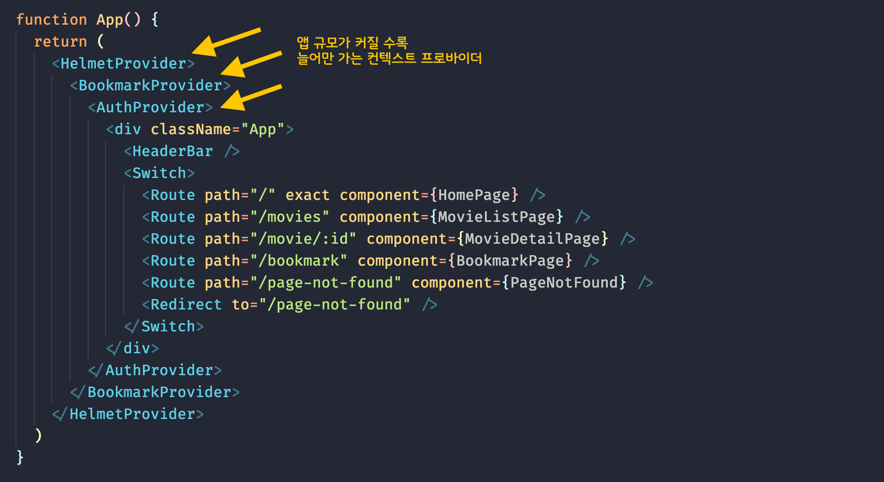
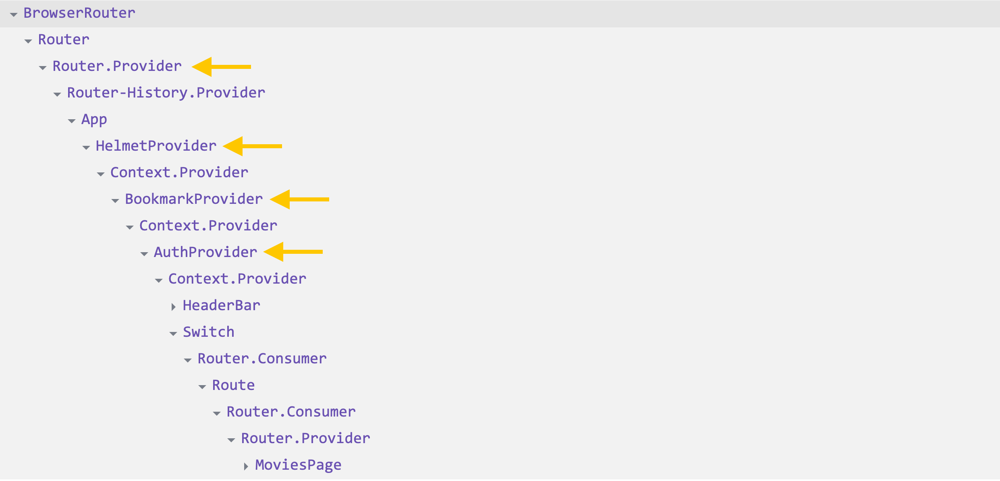

<br>

## Redux 상태 관리 라이브러리

결과적으로 앱 규모가 커질 수록 상태 관리가 어려워지는 Context API 보다 적합한 상태 관리 도구가 필요합니다. 
그 중 하나로 많이 사용되는 Redux 라이브러리에 대한 개념을 정리하고 활용하는 방법을 살펴봅니다.

### Redux의 3원칙

Redux는 다읨의 3가지 원칙을 지켜 사용합니다.

1. "단 하나"의 스토어 ([단일 진실 공급원](https://ko.wikipedia.org/wiki/%EB%8B%A8%EC%9D%BC_%EC%A7%84%EC%8B%A4_%EA%B3%B5%EA%B8%89%EC%9B%90): Single source of truth)
1. 상태는 "읽기 전용" (State is read only)
1. 리듀서(순수 함수) 만이 "쓰기 가능" (changes using pure functions)

### FLUX 패턴

Redux의 워크 플로우는 [FLEX 패턴](https://haruair.github.io/flux/docs/overview.html#content)대로 작동합니다.

> **ACTION** → **DISPATCHER** → **STORE** → **VIEW**


### Redux 워크 플로우

["단 방향 데이터 흐름(One-way Data flow)"](https://yamoo9.gitbook.io/learning-react-app/tip-and-references/react-one-way-data-flow)으로 상태를 관리하여 앱을 업데이트 합니다.

> 액션 디스패치 (액션 크리에이터 활용) → 루트 리듀서 → 스토어 → 상태 업데이트 → React 업데이트 → DOM 업데이트

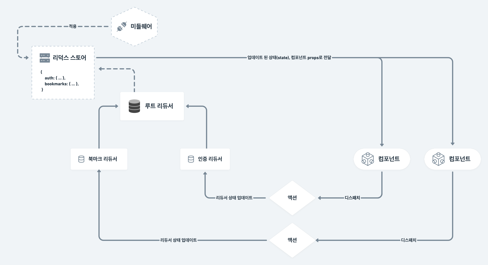

> [Redux 워크 플로우 다이어그램](https://whimsical.com/redux-HZT2Arfa55vc8qDN7NRbsN@2Ux7TurymMRQbk2TcXZq)을 크게 볼 수 있습니다. 👀

<br>

## Redux 개발 환경 구성

[Redux](https://redux.js.org/), [React Redux](https://react-redux.js.org/) 그리고 [미들웨어(middleware)](https://ko.wikipedia.org/wiki/%EB%AF%B8%EB%93%A4%EC%9B%A8%EC%96%B4)인 [redux-logger](https://www.npmjs.com/package/redux-logger) 패키지를 설치합니다.

```sh
npm i redux react-redux redux-logger
```

패키지 | 설명
--- | ---
redux | Redux 코어 라이브러리
react-redux | React 공식 Redux 바인딩 라이브러리
redux-logger | Redux의 작업 흐름(Work Flow) 기록 미들웨어

<br>

## redux 디렉토리 구조

Redux를 구성하는 디렉토리 구조는 다양합니다. 어떤 이는 액션 타입, 액션 크리에이터 함수, 초깃값과 리듀서 등을 각기 다른 파일로 구성합니다. 그리고 다른 이는 간단하게 디렉토리를 구성해 사용하기도 합니다.

그러므로 아래와 같은 간단한 구조로 디렉토리를 구성해 실습을 진행하겠습니다. 참고로 이 방법은 일반화 된 "표준"은 아닙니다.

```sh
src/redux
├── storage # 저장소
│   ├── auth # 인증 상태 관리
│   │   └── auth.js
│   ├── bookmarks # 북마크 상태 관리
│   │   └── bookmarks.js
│   └── index.js # 리듀서 병합 구성
└── store.js # Redux 스토어 구성
```

<br>

## 인증 상태 업데이트 흐름

컴포넌트를 통해 사용자가 인증 상태 업데이트를 요구하면 요청 정보(액션)를 디스패치 하여 인증 리듀서에 페이로드를 전달합니다. 리듀서는 요청 타입을 확인한 후,
페이로드를 통해 인증 상태를 업데이트 합니다. 업데이트 된 인증 정보는 컴포넌트에 props로 전달됩니다.

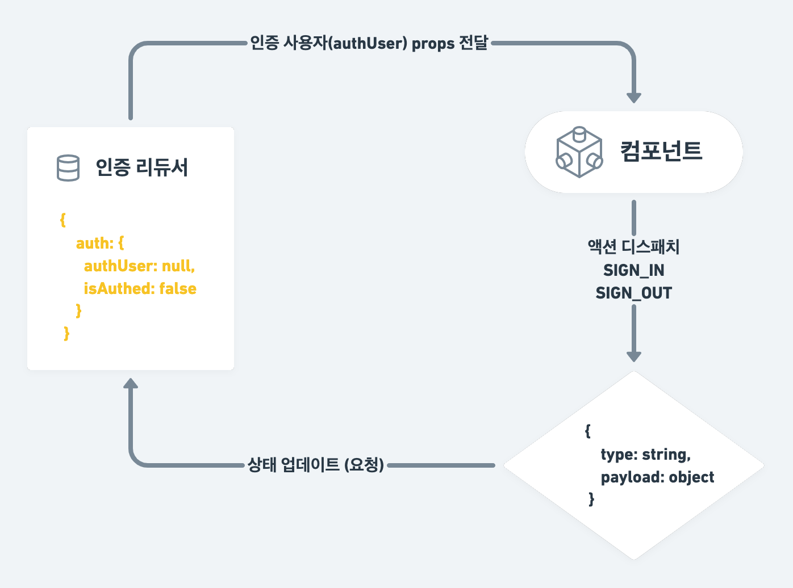

<br>

## 인증 액션 (Authetification actions)

리듀서, 액션 크리에이터에 사용될 액션 타입(action types)을 정의합니다.
그리고 로그인, 로그아웃 액션 크리에이터 함수를 각각 작성합니다.

```jsx
/* action types ------------------------------------------------------------- */

const SIGN_IN = '로그인'
const SIGN_OUT = '로그아웃'

/* action creators ---------------------------------------------------------- */

const signInAction = (currentUser) => ({
  type: SIGN_IN,
  authUser: currentUser,
})

const signOutAction = () => ({ type: SIGN_OUT })
```

<br>


## 인증 리듀서 (Authetification reducer)

인증 리듀서는 사용자 인증을 처리하는 순수 함수입니다. `useReducer()` 훅과 비슷하지만, 초기 상태 값을 직접 설정합니다.

```jsx
/* initial state + reducer -------------------------------------------------- */

const initialState = {
  authUser: null,
  isAuthed: false,
}

export const authReducer = (state = initialState, { type, authUser }) => {
  switch (type) {
    // 로그인
    case SIGN_IN:
      return {
        ...state,
        authUser,
        isAuthed: !!authUser,
      }
    
    // 로그아웃 (기본 처리)
    case SIGN_OUT:
      return initialState
    
    // 기본 (초기 상태)
    default:
  }
}
```

<br>

##  스토어 구성 (Configure Store)

루트 리듀서, 미들웨어를 설정해 Redux 스토어를 구성합니다.

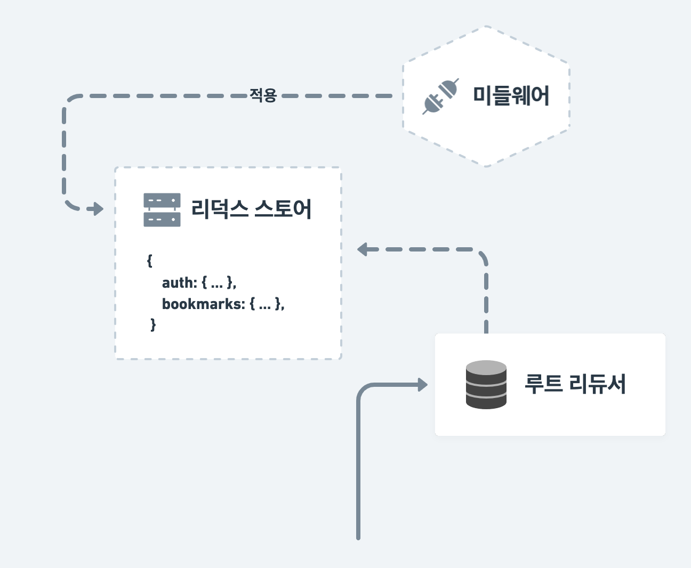

<br>

## 루트 리듀서 (Root reducer)

Redux는 하나 이상의 리듀서를 결합(combine)하는 `combineReducers` 모듈을 제공합니다.
작성 된 인증 리듀서(`authReducer`)를 불러와 리듀서를 병합(combine reducers)하는 코드를 작성합니다.

```jsx
import { combineReducers } from 'redux'
import { authReducer } from './auth/auth'

/* root reducer ------------------------------------------------------------- */

const rootReducer = combineReducers({
  // 인증 상태
  auth: authReducer,
})

export default rootReducer
```

<br>

## 스토어 생성 (Create Store)

Redux는 원칙에 따라 "단 하나의 스토어"를 가져야 합니다. 그리고 그 스토어는 `createStore` 모듈을 사용해 생성합니다.
스토어 생성 과정에 루트 리듀서를 전달해 설정해야 합니다.

```jsx
import { createStore } from 'redux'
import rootReducer from './storage'

/* store -------------------------------------------------------------------- */

const store = createStore(rootReducer)
```

<br>

## 미들웨어 적용 (Apply Middlewares)

Redux는 미들웨어를 적용해 확장된 스토어를 생성할 수 있도록 `applyMiddleware` 모듈을 제공합니다.
이를 사용해 Redux의 흐름을 기록하는 `redux-logger`를 미들웨어로 설정합니다.

```jsx
import { createStore, applyMiddleware } from 'redux'
import logger from 'redux-logger'
import rootReducer from './storage'

/* middlewares -------------------------------------------------------------- */

const middlewares = [logger]

/* store -------------------------------------------------------------------- */

const store = createStore(
  rootReducer, 
  applyMiddleware(...middlewares)
)
```

<br>

## 스토어 공급 (Provide Store)

구성한 스토어를 Provider를 통해 App에 공급합니다.

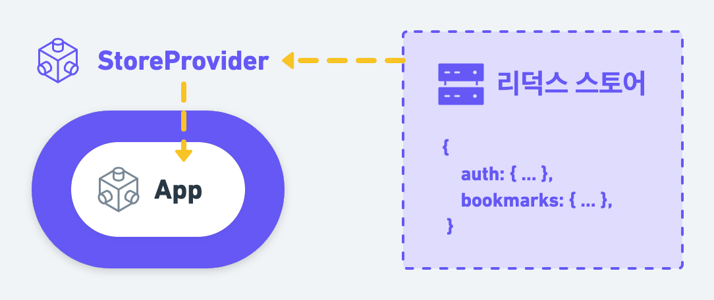

<br>

## React Redux의 Provider 컴포넌트

React Redux는 Redux를 효과적으로 React 앱에 적용할 수 있도록 도와줍니다. 이 패키지가 제공하는 Provider 컴포넌트는 스토어의 상태(`state`) 및 디스패치(`dispatch`)를 앱에 공급합니다.
리듀서를 사용해 상태와 디스패치를 제공하는 것은 `useReducer` 훅, 그것을 공급하는 역할은 Context API의 `Context.Provider`를 연상해보세요.

```jsx
import { Provider } from 'react-redux'
import store from 'store'

<Provider store={store}>
  {/* ... */}
</Provider>
```

### StoreProvider 래퍼 컴포넌트

`Provider`와 `store`를 `src/index.js`에서 불러와 구성할 수도 있지만... Context 모듈 패턴에서 다뤘던 `ContextProvider` 래퍼 컴포넌트 처럼, 
`StoreProvider` 래퍼 컴포넌트를 만들어 활용할 것입니다.

```jsx
import { Provider } from 'react-redux'

// ...

/* store provider wrapper component ----------------------------------------- */

export const StoreProvider = (props) => {
  // store 공급
  return <Provider store={store} {...props} />
}
```

<br>

## Store 공급(Provider)

`src/index.js` 파일에 `StoreProvider`를 불러와 `App` 컴포넌트를 래핑하면 앱 전체에 스토어의 상태, 디스패치를 공급할 수 있습니다.

```jsx
import { StoreProvider } from 'redux/store'
import App from './app/App'

render(
  <StrictMode>
    <Router>
      <StoreProvider>
        <App />
      </StoreProvider>
    </Router>
  </StrictMode>,
  document.getElementById('root')
)
```

<br>

## Context API → Redux 전환

**src/app/App.js**

`BookmarkProvider`, `AuthProvider` 컴포넌트를 모두 제거합니다.

```jsx
function App() {
  return (
    <div className="App">
      <HelmetProvider>
        <HeaderBar />
        <Switch>
          {/* ... */}
        </Switch>
      </HelmetProvider>
    </div>
  )
}

export default App
```

**src/containers/HeaderBar/HeaderBar.js**

이전에 작성된 `props` 전달 코드를 모두 제거하고, 다음과 같이 깔끔하게 HeaderBar 컴포넌트를 재구성합니다.

```jsx
export default function HeaderBar() {
  return (
    <header className={bar}>
      <HomeLink />
      <Navigation>
        <Profile />
      </Navigation>
    </header>
  )
}
```

<br>

## 스토어 상태 연결 (Connection)

공급된 스토어의 상태에 연결해야 컴포넌트에서 상태 값을 사용할 수 있습니다.

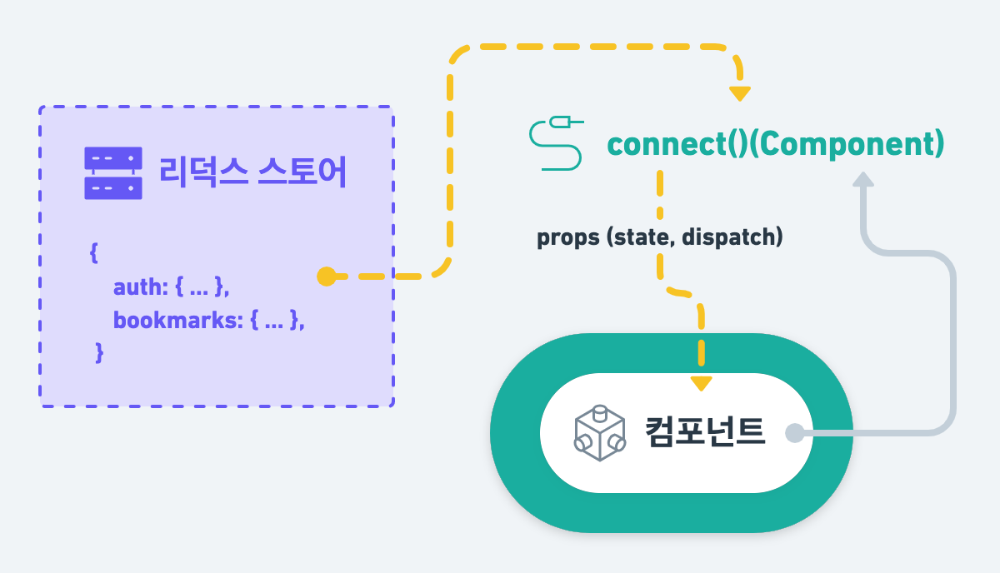

<br>

## React Redux의 커넥트(Connect)

React Redux는 Redux 스토어의 상태 및 디스패치를 효과적으로 React 앱에 적용할 수 있는 `connect` 모듈을 제공합니다.
`connect`는 [커링(currying)](https://ko.javascript.info/currying-partials) 함수로 각 인자가 호출 가능한 
프로세스로 호출, 병합되도록 변환합니다. 커링은 함수를 호출하지 않습니다. 단지 변환할 뿐입니다.

```jsx
import { connect } from 'react-redux'

// ...

// connect() 함수를 사용해 스토어의 상태, 디스패치를 연결된 컴포넌트의 props로 설정하는 함수 생성
const withConnect = connect(mapStateToProps, mapDispatchtoProps)

// withConnect() 함수를 사용해 Component 컴포넌트의 props에 상태, 디스패치 전달
export default withConnect(Component)
```

위에서 나눠 작성한 `connect` 프로세스는 아래와 같이 연결지어 작성할 수 있습니다.

```jsx
export default connect(mapStateToProps, mapDispatchtoProps)(Component)
```

### 스토어 상태(state) → 컴포넌트 props 매핑

`connect()` 함수에 전달되는 1번째 인자는 스토어의 상태를 컴포넌트 `props`로 [매핑(mapping)](https://ko.wikipedia.org/wiki/%EC%82%AC%EC%83%81_(%EC%BB%B4%ED%93%A8%ED%8C%85)) 합니다.

```jsx
const mapStateToProps = (state) => ({
  authUser: state.user.authUser,
  isAuthed: state.user.isAuthed
})
```

### 스토어 디스패치(dispatch) → 컴포넌트 props 매핑

`connect()` 함수에 전달되는 2번째 인자는 스토어의 디스패치를 컴포넌트 `props`로 매핑(mapping) 합니다.

```jsx
import { signInAction, signOutAction } from 'redux/storage/auth/auth'

// ...

const mapDispatchtoProps = (dispatch) => ({
  onSignIn: (currentUser) => dispatch(signInAction(currentUser)),
  onSignOut: () => dispatch(signOutAction()),
})
```

디스패치에 액션을 전달해 실행하는 패턴은 매우 일반적이므로 아래와 같이 객체 값을 할당하고,
액션 크리에이터만 설정해도 `connect()` 함수가 알아서 컴포넌트 `props`로 매칭해줍니다.
특별한 이유가 없을 경우 항상 이 방법을 사용하길 권장합니다.

```jsx
const mapDispatchtoProps = {
  onSignIn: signInAction,
  onSignOut: signOutAction
}
```

### 내비게이션(Navigation) 컴포넌트

`connect()()` 사용법을 정리했으니 Navigation 컴포넌트 코드를 다음과 같이 수정합니다.

```jsx
/* redux -------------------------------------------------------------------- */

import { connect } from 'react-redux'
import { signInAction, signOutAction } from 'redux/storage/auth/auth'

const mapStateToProps = ({ auth }) => ({
  authUser: auth.authUser,
  isAuthed: auth.isAuthed,
})

const mapDispatchToProps = (dispatch) => ({
  onSignIn: (currentUser) => dispatch(signInAction(currentUser)),
  onSignOut: () => dispatch(signOutAction),
})

function Navigation({ authUser, isAuthed, onSignIn, onSignOut, children }) { /* ... */ }

// connect()() → 고차 컴포넌트(HOC) 반환
export default connect(mapStateToProps, mapDispatchToProps)(Navigation)
```

`mapDispatchtoProps` 코드는 다음과 같이 간단하게 변경해 사용할 수도 있습니다. (권장)

```jsx
const mapDispatchToProps = {
  onSignIn: signInAction,
  onSignOut: signOutAction,
}
```

아래는 수정된 Navigation 컴포넌트 코드입니다.

```jsx
/* dummy authUser ----------------------------------------------------------- */

const dummyAuthUser = {
  uid: '0FIAXz7FlGRhQlkuydyM5Vwv0bc2',
  displayName: '야무',
  photoURL: 'https://bit.ly/3f91TZy',
  email: 'yamoo9@euid.dev',
}

/* component ---------------------------------------------------------------- */

function Navigation({ authUser, isAuthed, onSignIn, onSignOut, children }) {
  const history = useHistory()
  const location = useLocation()

  const isMoviePageActive = location.pathname.match(/movie/) ? true : false
  const activeClassName = isMoviePageActive ? active : null

  return (
    <nav className={container} aria-label="글로벌 내비게이션">
      <ul lang="en" className={!isAuthed ? removeSpaceR : null}>
        <li>
          <NavLink to="/movies" className={activeClassName}>Movies</NavLink>
        </li>
        {!isAuthed ? (
          <>
            <li>
              <a
                role="button"
                href="#sign-in"
                onClick={(e) => {
                  e.preventDefault()
                  // 로그인
                  onSignIn(dummyAuthUser)
                }}
              >
                Sign In
              </a>
            </li>
            <li>
              <a
                role="button"
                href="#sign-up"
                onClick={(e) => {
                  e.preventDefault()
                }}
              >
                Sign Up
              </a>
            </li>
          </>
        ) : (
          <>
            <li>
              <NavLink to="/bookmark" activeClassName={active}>Bookmark</NavLink>
            </li>
            <li>
              <a
                role="button"
                href="#sign-out"
                onClick={(e) => {
                  e.preventDefault()
                  history.push('/')
                  // 로그아웃
                  onSignOut()
                }}
              >
                Sign Out
              </a>
            </li>
          </>
        )}
      </ul>
      {isAuthed && children}
    </nav>
  )
}
```

<br>

## React Redux의 훅(Hooks)

React Redux가 제공하는 `useSelector` 훅을 활용해 상태를 선택하거나, `useDispatch` 훅을 통해 디스패치를 사용할 수 있습니다.

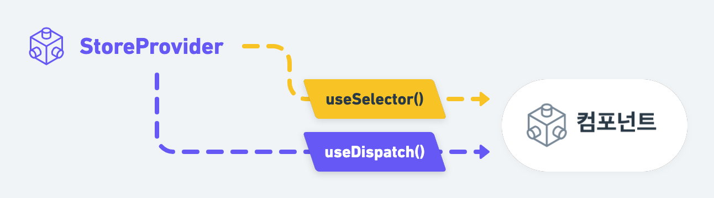

```jsx
import { useSelector, useDispatch } from 'react-redux'
import { signInAction, signOutAction } from 'store/auth/auth.slices'

// ...

export function Component() {
  // 상태 선택
  const authUser = useSelector((state) => state.user.authUser)

  // 디스패치 추출
  const dispatch = useDispatch()

  // 로그인 함수
  const signIn = (currentUser) => dispatch(signInAction(currentUser))
  // 로그아웃 함수
  const signOut = () => dispatch(signOutAction())

  // ...

}
```

### 프로필(Profile) 컴포넌트

React Redux의 `useSelector` 훅을 사용해 Redux 스토어 인증 상태(`auth`)의 `authUser`를 선택합니다.
그리고 `photoURL`, `displayName` 값을 추출해 컴포넌트에 인터폴레이션 하도록 코드를 구성합니다.

```jsx
/* react-redux hooks -------------------------------------------------------- */

import { useSelector } from 'react-redux'

/* -------------------------------------------------------------------------- */

export default function Profile() {
  // 인증 상태에서 사진, 표시 이름을 추출
  const { photoURL, displayName } = useSelector(({ auth }) => auth.authUser)

  return (
    <figure className={container}>
      <LazyLoadingImg src={photoURL} size={24} alt="" className={imgPath} />
      <figcaption>‪{displayName}</figcaption>
    </figure>
  )
}
```

<br>

수정이 잘 반영되었다면? 로그인 버튼을 눌렀을 때, Redux 스토어의 인증 상태 업데이트가 브라우저 Console 패널에 기록됩니다.

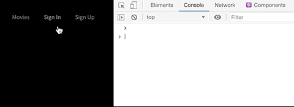

<br>
<br>

## Reselect 라이브러리 활용

앞서 작성한 `useSelector` 훅은 함수 컴포넌트가 렌더링 될 때 마다 실행됩니다. 
예를 들어 액션을 디스패치 하여 상태가 업데이트 될 때 마다 훅이 다시 실행됩니다.
문제는 **이전 상태 값과 현재 상태 값이 동일해도 매번 계산을 수행**한다는 점입니다.

성능 개선을 목적으로 불필요한 계산을 다시 수행하지 않도록 하려면 **이전 상태를 메모이제이션(memoization)** 해야 합니다.
이런 경우 [reselect](https://github.com/reduxjs/reselect) 라이브러리를 활용해 간편하게 이전 상태를 기억하도록 설정할 수 있습니다.
패키지를 설치합니다.

```sh
npm i reselect
```

설치된 패키지에서 `createSelector` 모듈을 불러와 셀렉터(선택자) 함수를 만듭니다. 셀렉터 함수는 스토어의 상태를 반환합니다.
그리고 외부에서 사용할 수 있도록 메모이제이션 셀렉터 함수를 내보냅니다. 

이 함수는 `createSelector()` 함수에 셀렉터 함수를 전달하고,
콜백 함수에서 상태 값을 받아 기억하고자 하는 값을 반환합니다. 즉, **이전 상태와 현재 상태가 동일한 경우 기억된 값을 사용하므로 계산을 다시 하지 않습니다.**

**src/redux/storage/auth/auth.js**

```jsx
/* reselect ----------------------------------------------------------------- */

import { createSelector } from 'reselect'

const selectAuthState = (state) => state.auth

export const selectAuth = createSelector([selectAuthState], (auth) => auth)
```

**src/components/Profile/Profile.js**

`useSelector` 훅의 콜백 함수에 전달된 스토어의 상태를 메모이제이션 셀렉트 함수에 전달할 경우,
`authUser` 상태 값은 기억된 값을 사용하게 되며 **이전 기억 값과 현재 값이 동일한 경우 기억된 값을 사용**하게 됩니다.

```jsx
/* memoization select function ---------------------------------------------- */

import { selectAuth } from 'redux/storage/auth/auth'

/* component ---------------------------------------------------------------- */

export default function Profile() {
  const { photoURL, displayName } = useSelector(
    (state) => selectAuth(state).authUser
  )

  return (
    <figure className={container}>
      <LazyLoadingImg src={photoURL} size={24} alt="" className={imgPath} />
      <figcaption>‪{displayName}</figcaption>
    </figure>
  )
}
```

**src/components/Navigation/Navigation.js**

`connect()`를 사용한 예에서도 메모이제이션 셀렉트 함수를 사용할 수 있습니다. 현재 상태 값이 변경되지 않았다면,
기억된 이전 상태 값을 사용하도록 코드를 다음과 같이 수정합니다.

```jsx
import {
  selectAuth,
  signInAction,
  signOutAction,
} from 'redux/storage/auth/auth'

const mapStateToProps = (state) => {
  // 메모 된 인증 상태 값 추출
  const { authUser, isAuthed } = selectAuth(state)

  // 컴포넌트 props로 매핑
  return {
    authUser,
    isAuthed,
  }
}
```

<br>

로그인/로그아웃 버튼을 눌러 Redux 스토어에서 인증 상태를 관리하는 것을 브라우저 Console에서 확인해봅니다.

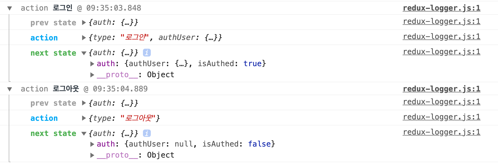

<br>

## [미션 1] 북마크(Bookmark) 상태 관리

Redux를 사용해 인증 상태를 관리하는 방법을 학습했으니, 이어서 북마크 상태를 Redux로 관리하는 실습을 진행해봅니다.


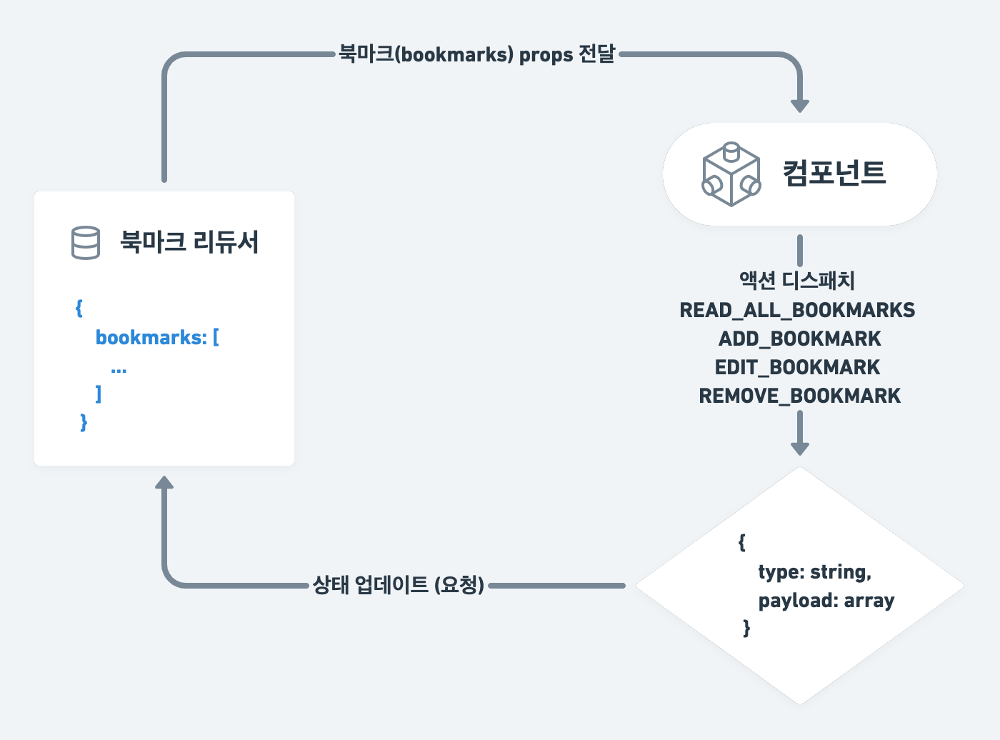

**src/redux/storage/bookmarks/bookmarks.js**

셀렉터 함수, 액션 타입, 액션 크리에이터 함수 그리고 초기 상태 값, 리듀서 함수를 작성해보세요.

```jsx
/* reselect ----------------------------------------------------------------- */

// 셀렉트 함수를 작성합니다.

/* action types ------------------------------------------------------------- */

// 액션 타입을 작성합니다.

/* action creators ---------------------------------------------------------- */

// 액션 크리에이터 함수를 작성합니다.

/* initial state + reducer -------------------------------------------------- */

// 초기 상태 값을 작성합니다.
// 리듀서 함수를 작성합니다.

```


<br>

<details>
  <summary><b>미션 풀이</b> (잠깐! 미션 완료 전까지 열어보면 안되요! 😡)</summary>

  <br>

  이런! 열어보지 말라니까요.. 😏 훗

  <details>
    <summary>src/redux/storage/bookmarks/bookmarks.js</summary>
    <br>

  ```jsx
  /* reselect ----------------------------------------------------------------- */
  import { createSelector } from 'reselect'

  const selectBookmarksState = (state) => state.bookmarks

  export const selectBookmarks = createSelector(
    [selectBookmarksState],
    (bookmarks) => bookmarks
  )

  /* action types ------------------------------------------------------------- */

  const READ_ALL_BOOKMARKS = '모든 북마크 읽기'
  const ADD_BOOKMARK = '북마크 추가'
  const EDIT_BOOKMARK = '북마크 수정'
  const REMOVE_BOOKMARK = '북마크 제거'

  /* action creators ---------------------------------------------------------- */

  export const readAllBookmarksAction = () => ({
    type: READ_ALL_BOOKMARKS,
  })

  export const addBookmarkAction = (newBookmark) => ({
    type: ADD_BOOKMARK,
    newBookmark,
  })

  export const editBookmarkAction = (willEditBookmark) => ({
    type: EDIT_BOOKMARK,
    willEditBookmark,
  })

  export const removeBookmarkAction = (willRemoveBookmark) => ({
    type: REMOVE_BOOKMARK,
    willRemoveBookmark,
  })

  /* initial state + reducer -------------------------------------------------- */

  const initialState = []

  export const bookmarkReducer = (state = initialState, action) => {
    switch (action.type) {
      default:
      case READ_ALL_BOOKMARKS:
        return state

      case ADD_BOOKMARK:
        return [...state, action.newBookmark]

      case EDIT_BOOKMARK:
        return state.map((bookmark) =>
          bookmark.id === action.willEditBookmark.id
            ? action.willEditBookmark
            : bookmark
        )

      case REMOVE_BOOKMARK:
        return state.filter(
          (bookmark) => bookmark.id !== action.willRemoveBookmark.id
        )
    }
  }
  ```
  </details>
  
</details>

<br>

## [미션 2] 영화 정보 페이지 컴포넌트 재구성

Context API에서 Redux로 상태 관리 도구를 변경했으니, 영화 정보(MovieDetail) 페이지 컴포넌트 코드도 재구성 되어야 합니다.
Redux 스토어에서 상태 관리를 할 수 있도록 코드를 작성해보세요.

**src/pages/movies/MovieDetail.js**

```jsx
/* dispatch + action creator ------------------------------------------------ */

// 이 곳에 코드를 작성합니다.

/* component ---------------------------------------------------------------- */

const { idle, pending, rejected, resolved } = STATUS

export default function MovieDetailPage({ match }) { /* ... */ }
```

<br>

<details>
  <summary><b>미션 풀이</b> (잠깐! 미션 완료 전까지 열어보면 안되요! 😡)</summary>

  <br>
  
  설마!? 이번에도 열어본 건 아니겠지요? 설마.... 🥴

  <details>
    <summary>src/pages/Bookmark/Bookmark.js</summary>
    <br>

  ```jsx
  import React from 'react'
  import { Link } from 'react-router-dom'
  import { Helmet } from 'react-helmet-async'

  import { tmdb } from 'api'
  import { Bookmark } from 'components'

  import { useSelector, useDispatch } from 'react-redux'

  import {
    selectBookmarks,
    readAllBookmarksAction,
    removeBookmarkAction,
  } from 'redux/storage/bookmarks/bookmarks'

  /* component ---------------------------------------------------------------- */

  export default function BookmarkPage() {
    const bookmarks = useSelector((state) => selectBookmarks(state))
    const dispatch = useDispatch()

    React.useEffect(() => dispatch(readAllBookmarksAction()), [dispatch])

    const handleRemoveBookmark = (willRemoveBookmark) =>
      dispatch(removeBookmarkAction(willRemoveBookmark))

    return (
      <div className="bookmark-page">
        <Helmet>
          <title>북마크 페이지 (인증 사용자 전용) ← "나의 영화" 서비스</title>
        </Helmet>

        {bookmarks.length === 0 ? (
          <Bookmark.Empty>
            <h2>북마크 된 영화가 존재하지 않습니다.</h2>
            <Link to="/movies">영화 목록 페이지로 이동하시겠습니까?</Link>
          </Bookmark.Empty>
        ) : (
          <Bookmark.List>
            {bookmarks.map(
              ({ id, poster, title, tagline, overview, homepage }) => {
                return (
                  <Bookmark key={id}>
                    <Bookmark.HomepageLink href={homepage} external>
                      <Bookmark.Poster src={tmdb.getImageURL(poster)} alt="" />
                    </Bookmark.HomepageLink>
                    <Bookmark.Container>
                      <Bookmark.Container column>
                        <Bookmark.Title>{title}</Bookmark.Title>
                        <Bookmark.Tagline>{tagline}</Bookmark.Tagline>
                      </Bookmark.Container>
                      <Bookmark.Button
                        isActive={true}
                        iconProps={{ size: '2x' }}
                        onClick={() =>
                          handleRemoveBookmark({
                            id,
                            poster,
                            title,
                            tagline,
                            overview,
                            homepage,
                          })
                        }
                      />
                    </Bookmark.Container>
                    <Bookmark.Overview>{overview}</Bookmark.Overview>
                  </Bookmark>
                )
              }
            )}
          </Bookmark.List>
        )}
      </div>
    )
  }
  ```
  </details>
  
</details>

<br>

## Redux 개발 도구 확장

보다 상세한 상태 정보 확인 및 업데이트 흐름을 파악하고자 한다면? Chrome 확장 [Redux 개발 도구(DevTools)](https://chrome.google.com/webstore/detail/redux-devtools/lmhkpmbekcpmknklioeibfkpmmfibljd?hl=ko-KR)를 사용할 수 있습니다.

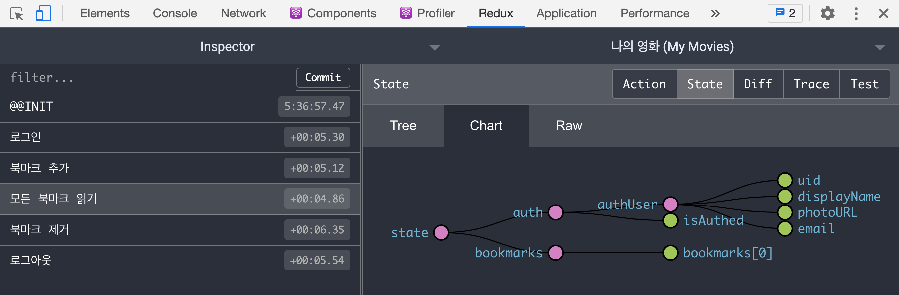

Chrome 확장을 설치한 후에는 [redux-devtools-extension](https://www.npmjs.com/package/redux-devtools-extension) 패키지를 프로젝트에 설치합니다.

```sh
npm i redux-devtools-extension
```

패키지에서 `composeWithDevTools` 모듈을 추출해 Redux 스토어 구성에 추가합니다.

```jsx
import { composeWithDevTools } from 'redux-devtools-extension'

// ...

const store = createStore(
  rootReducer,
  composeWithDevTools(applyMiddleware(...middlewares))
)
```

<br>

## Redux Persist 라이브러리

Redux 스토어는 앱이 종료되면 모든 상태가 사라집니다. 그러므로 개발 중에 수시로 브라우저 새로고침을 해야할 때면
상태가 초기화 되어 불편합니다. 이런 경우 로컬 스토리지를 사용해 스토어의 상태를 저장할 수 있습니다.
하지만 Redux 스토어 상태는 방대해질 수 있으므로 이를 처리하는 전문 라이브러리를 활용할 필요가 있습니다.

[redux-persist](https://www.npmjs.com/package/redux-persist) 라이브러리를 사용하면 손쉽게
Redux 스토어의 상태를 로컬 스토리지에 저장할 수 있습니다. 패키지를 설치합니다.

```sh
npm i redux-persist
```

Redux 스토어 상태를 지속(persist)하려면 redux-persist 라이브러리를 다음과 같이 설정해야 합니다.

```jsx
// Redux 상태 지속을 위한 스토어, 리듀서
import { persistStore, persistReducer } from 'redux-persist'
// React 통합을 위한 Redux Persist 게이트
import { PersistGate } from 'redux-persist/integration/react'
// 웹 LocalStorage
import storage from 'redux-persist/lib/storage' 

/* persist store ------------------------------------------------------------ */

// Redux 상태 지속 설정
const persistConfig = {
  key: 'root',
  // 저장할 스토리지를 설정합니다.
  storage,
  // 와이트리스트에 등록된 상태만 저장합니다.
  whitelist: ['bookmarks', 'auth'],
  // 블랙리스트에 등록된 상태는 제외합니다.
  // blacklist: []
}

// Redux 상태 지속을 위한 리듀서 ← rootReducer
const persistedReducer = persistReducer(persistConfig, rootReducer)

/* store -------------------------------------------------------------------- */
 
const store = createStore(
  persistedReducer, // Redux 상태 지속을 위한 리듀서 설정
  composeWithDevTools(applyMiddleware(...middlewares))
)

// Redux 상태 지속을 위한 스토어
const persistor = persistStore(store)

/* store provider wrapper component ----------------------------------------- */

export const StoreProvider = (props) => {
  return (
    <Provider store={store}>
      {/* Redux Persist 게이트 ← persistor 설정 */}
      <PersistGate loading={null} persistor={persistor}>
        {props.children}
      </PersistGate>
    </Provider>
  )
}
```

설정이 마무리 되면 앱이 종료되어도 Redux 상태가 유지되는 것을 확인할 수 있습니다.

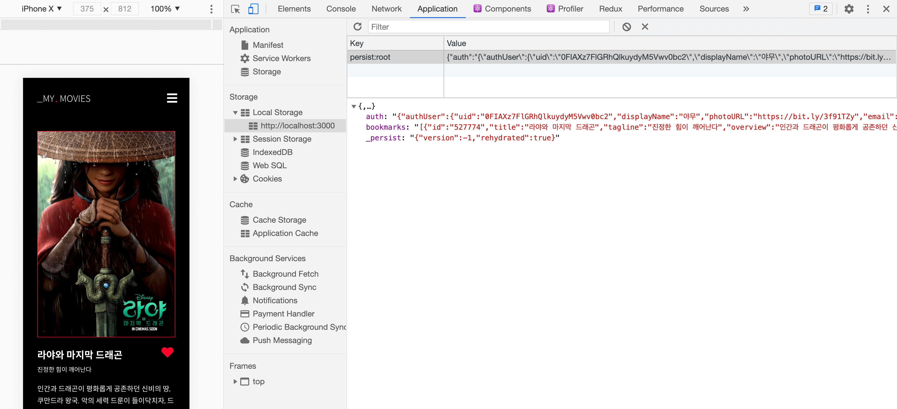
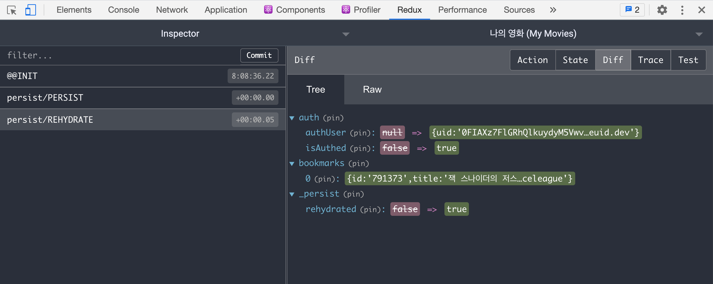