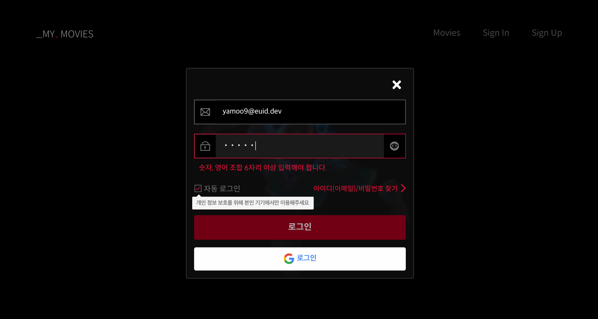
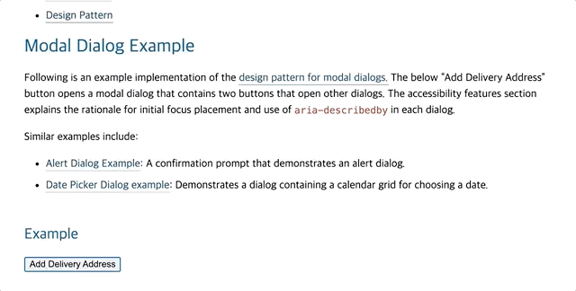
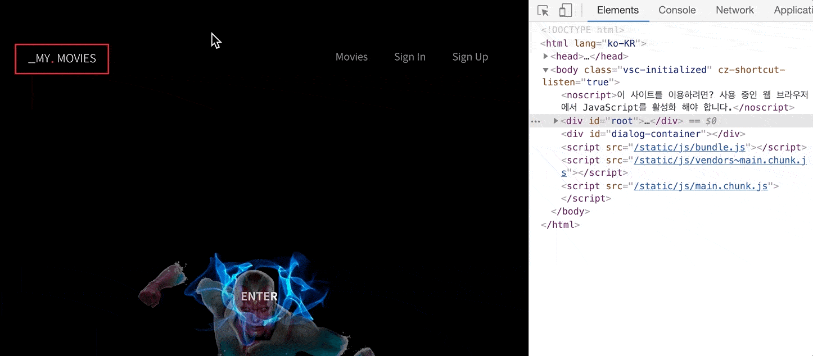
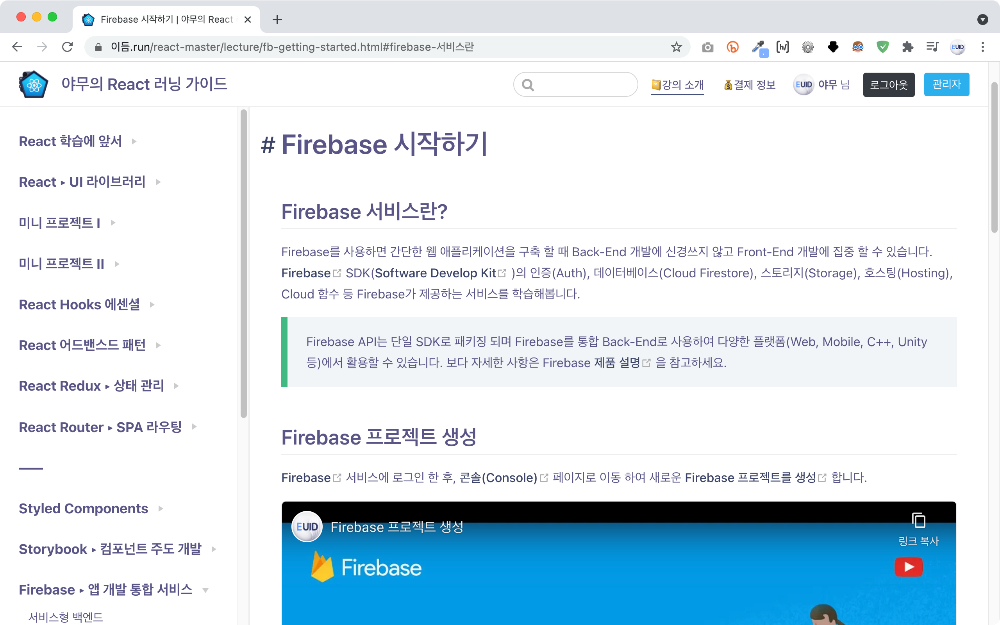

# 학습 주제

3월 30일 학습 시간에 다룰 주제입니다.

- [x] 다이얼로그 컴포넌트 (모달) ← `접근성 디자인 패턴 반영`
- [x] 폼 컨테이너 컴포넌트 (로그인/회원가입) ← `쿠팡 로그인 페이지 컴포넌트 재사용`
- [x] Firebase 서비스 (인증, 데이터베이스) 활용
<!-- - [x] Google 인증 공급자(AuthProvider) 인증
- [x] Firestore → Users 컬렉션
- [x] 이메일/패스워드 인증
- [x] Firestore → Bookmarks 컬렉션 -->

<br>

## 다이얼로그(모달) 컴포넌트

그래픽 사용자 인터페이스(GUI)에서 [다이얼로그(Dialog)](https://ko.wikipedia.org/wiki/%EB%8C%80%ED%99%94_%EC%83%81%EC%9E%90)는 사용자에게 정보를 보여 주거나 응답을 받을 때 사용합니다. "대화 상자"라고 부르는 이유는 컴퓨터와 사용자 사이에 대화할 수 있는 기능을 제공하기 때문입니다. 사용자에게 무언가를 알려 주거나 사용자로부터 입력을 요청하는 일 등을 수행합니다. 실습에서는 회원가입, 로그인 폼을 통해 사용자 정보를 입력 요청합니다.



### 학습 과정에서 다뤄야 할 주제

Dialog 컴포넌트 코드를 리뷰하며 사용된 React의 주제에 대해 정리해봅니다.

- [포털(Portals, 차원 이동)](https://ko.reactjs.org/docs/portals.html)
- [DOM에 refs 전달하기](https://ko.reactjs.org/docs/forwarding-refs.html#forwarding-refs-to-dom-components)

<br>

### 접근성 디자인(설계) 패턴

[WAI-ARIA Practice 1.1, W3C](https://www.w3.org/TR/wai-aria-practices-1.1/#dialog_modal) 문서는 접근성을 준수한 다이얼로그(모달) 컴포넌트 설계 방법을 안내합니다. 
예를 들어 모달 다이얼로그는 요청한 내용을 입력 받고, 사용자가 확인하기 전까지 다른 콘텐츠를 이용하지 못하도록 차단해야 합니다. 모달이 없는 일반 다이얼로그와 마찬가지로 탭으로 이동(`tab` 또는 `shift` + `tab`) 할 수 있어야 하고,
사용자 확인하기 전까지는 탭 이동을 다이얼로그 내부에서 순환시켜야 합니다.

> 👏🏻 **모달 다이얼로그의 탭 이동은 사용자 확인이 있기 전까지 다이얼로그 내부에서 순환되도록 해야 한다.**

<br>

#### 키보드 인터랙션

다이얼로그가 화면에 표시되면 반드시 포커스가 다이얼로그 또는 다이얼로그 내부의 키보드 탭 이동이 가능한 요소(`tabindex="0"` 설정 요소 포함)로 이동되어야 합니다. 그리고 다이얼로그 콘텐츠를 `tab`(다음 요소) 또는 `shift`+`tab`(이전 요소)로 탐색할 수 있어야 하며, `Esc` 키를 누르면 다이얼로그를 닫을 수 있어야 합니다. 다이얼로그가 닫히면 논리적인 순서에 따라 다이얼로그를 연 버튼 또는 그 버튼의 다음 요소로 포커스를 돌려줘야 합니다.



#### WAI-ARIA 역할, 속성

HTML 표준 요소 중 다이얼로그 의미를 가진 요소가 존재하지 않으므로, WAI-ARIA 국제 표준 기술을 사용해 요소에 의미(역할, role)를 부여하고, 속성(attributes) 및 상태(state)를 설정해야 합니다.

| 요소 | 역할 | 속성 |  비고
| -- | -- |-- |  -- |
| \<div\> | `role="dialog"` | | |
|  | | `aria-modal=(true\|false)` | 모달이 포함된 경우 `true`, 일반 다이얼로그인 경우 `false`
|  | | `aria-label="다이얼로그 제목"` | 제목이 UI에 표시되지 않을 경우
|  | | `aria-labelledby="제목요소 ID"` | 제목이 UI에 표시될 경우
|  | | `aria-describedby="설명요소 ID"` | 다이얼로그 설명이 필요한 경우 (옵션)

#### HTML 마크업 예시

WAI-ARIA 디자인 패턴에 따라 다이얼로그를 HTML로 구조화 하면 다음과 같이 구현되어야 합니다.

```html
<div 
  role="dialog"
  aria-modal="true"
  aria-labelledby="signUpDialog"
  aria-describedby="signUpDialog__summary"
  tabindex="-1"
  class="signUpDialog"
>
  <!-- 시각적으로 타이틀이 표시되지 않을 경우 aria-label로 대체 -->
  <h3 id="signUpDialog">회원가입 폼</h3>
  
  <form id="signUpDialog__form" onsubmit="registerMember()">
    <!-- 회원 가입 폼 컨트롤 ... -->
  </form>

  <!-- 다이얼로그 닫기 버튼은 논리적으로 가장 마지막에 위치해야 함 -->
  <button
    type="button"
    class="signUpDialog__closeButton"
    aria-label="회원가입 폼 닫기"
    onclick="closeModalDialog()"
  > 
    x
  </button>
</div>

<div role="presentation" class="signUpDialog__modal"></div>

<p class="a11yHidden" id="signUpDialog__summary">
  회원가입 폼 다이얼로그 설명 (옵션)
</p>
```

### Dialog 컴포넌트 접근성 실습

React 앱에 사용된 Dialog 컴포넌트의 "**[포커스 트랩(Focus Trap)](https://medium.com/@im_rahul/focus-trapping-looping-b3ee658e5177)**"을 구현해봅니다.
고려해야 할 사항은 다음과 같습니다.

1. Dialog가 열리면 Dialog 또는 내부에 포커스 가능한 요소로 포커스가 이동되어야 한다.
1. Dialog 내부의 첫번째 포커스 요소가 활성된 상태에서 `shift` + `tab` 키를 누르면 마지막 포커스 요소로 포커스가 이동 되어야 한다.
1. Dialog 내부의 마지막 포커스 요소가 활성된 상태에서 `tab` 키를 누르면 첫번째 포커스 요소로 포커스가 이동 되어야 한다.
1. 사용자 확인으로 Dialog가 닫히면 Dialog를 연 버튼으로 포커스가 이동되어야 한다.
1. 위 동작은 사용자가 `Esc` 키를 눌렀을 때도 동일하게 작동되어야 한다.
1. Dialog가 열리면 React 루트 요소에 `aria-hidden="true"` 속성을 설정해 모바일 환경에서도 정상적으로 작동 되도록 해야 한다.


<br>



<br>
<br>

> **React에서는 접근성을 지킬 수 없다?!**<br><br>
> 키보드 운용에 관한 접근성은 가상 DOM에서 처리할 수 없습니다. 실제 DOM이 마운트 된 이후 적용해야 합니다.
> 이런 점 때문에 React에서는 접근성을 지킬 수 없다고 유언비어(流言蜚語)를 퍼트리는 나쁜! 개발자들이 적지 않습니다. 
> 여러분들은 잘 알지도 못하면서 무조건 안된다고 말하는 나쁜! 개발자가 되지 않길 바랍니다. 😎


<br>
<br>

## 서비스형 백앤드 (BaaS)

[서비스형 백앤드(Back-end as a Service)](https://xn--xy1bk56a.run/react-master/lecture/fb-baas-is.html)로서 Firebase를 앱에 적용해봅니다.


<br>

## Firebase 시작하기

Firebase를 사용하면 간단한 웹 애플리케이션을 구축 할 때 Back-End 개발에 신경쓰지 않고 Front-End 개발에 집중 할 수 있습니다. Firebase SDK 인증(Auth), 데이터베이스(Cloud Firestore), 스토리지(Storage) 등 제공되는 서비스를 활용해봅니다.

[](https://firebase.google.com/products/auth)
[](https://firebase.google.com/products/firestore)
[](https://firebase.google.com/products/storage)

<br>

## Firebase 구성

[JavaScript 프로젝트에 Firebase 추가](https://firebase.google.com/docs/web/setup?authuser=1) 문서를 참고해 프로젝트에 Firebase를 구성합니다.
(실습은 작성된 [문서](https://xn--xy1bk56a.run/react-master/lecture/fb-getting-started.html)를 참고)



<br>
<br>

<details>
  <summary>Firebase 구성 코드</summary>
  <br>

  ```jsx
  import firebase from 'firebase/app'
  import 'firebase/auth'
  import 'firebase/firestore'

  /* config ------------------------------------------------------------------- */

  const {
    REACT_APP_FB_API_KEY,
    REACT_APP_FB_AUTH_DOMAIN,
    REACT_APP_FB_DB_URL,
    REACT_APP_FB_PROJECT_ID,
    REACT_APP_FB_STORAGE_BUCKET,
    REACT_APP_FB_MESSAGE_ID,
    REACT_APP_FB_APP_ID,
  } = process.env

  const config = {
    apiKey: REACT_APP_FB_API_KEY,
    authDomain: REACT_APP_FB_AUTH_DOMAIN,
    databaseURL: REACT_APP_FB_DB_URL,
    projectId: REACT_APP_FB_PROJECT_ID,
    storageBucket: REACT_APP_FB_STORAGE_BUCKET,
    messagingSenderId: REACT_APP_FB_MESSAGE_ID,
    appId: REACT_APP_FB_APP_ID,
  }

  /* initialization ----------------------------------------------------------- */

  firebase.initializeApp(config)

  /* export modules ----------------------------------------------------------- */

  export const auth = firebase.auth()
  export const firestore = firebase.firestore()

  export default firebase
  ```
</details>

<br>

## Google 인증 (로그인)

Firebase 인증(Authentificaation) 서비스를 사용해 앱에 Google 로그인 기능을 추가해봅니다. ([Google 로그인 인증](https://firebase.google.com/docs/auth/web/google-signin?authuser=1) 문서 참고)

<details>
  <summary>GoogleAuthProvider 코드</summary>
  <br>

  ```jsx 
  /* Google Auth Provider ----------------------------------------------------- */

  const googleProvider = new firebase.auth.GoogleAuthProvider()
  googleProvider.setCustomParameters({ prompt: 'select_account' })

  // 로그인 함수 내보내기
  export const signInWithGoogle = () => auth.signInWithPopup(googleProvider)
  ```

  공급 업체의 OAuth 과정을 사용자가 선호하는 언어로 현지화하려면 OAuth 과정 시작 전에 인증 인스턴스의 언어 코드를 업데이트합니다. (선택)

  ```js
  auth.languageCode = 'ko'

  // 명시적으로 언어를 설정하는 대신, 브라우저의 기본 환경 설정을 적용할 수도 있습니다.
  // auth.useDeviceLanguage()
  ```
</details>

<br>


<br>

## 인증 사용자

로그인 한 사용자는 Auth 인스턴스(`auth`)의 현재 사용자(`currentUser`)가 됩니다. 
이 인스턴스는 사용자의 상태를 유지하여 브라우저에서 페이지를 새로고침 하거나 애플리케이션을 재시작 해도 사용자의 정보가 사라지지 않게 합니다.
사용자가 로그아웃하면 Auth 인스턴스가 User 객체에 대한 참조 유지를 중단하고 사용자 상태를 유지하지 않습니다. ([현재 사용자](https://firebase.google.com/docs/auth/users?authuser=1#the_current_user) 참고)

```js
auth.currentUser
```

<br>

## 로그아웃

로그아웃(signOut) 메서드를 사용하면 인증 상태를 해제할 수 있습니다. ([signOut](https://firebase.google.com/docs/reference/js/firebase.auth.Auth?authuser=1#signout) 참고)

```js
// 로그아웃 함수 내보내기
export const signOut = () => auth.signOut()
```

<br>

## 인증 상태 관찰

인증 객체의 [onAuthStateChanged](https://firebase.google.com/docs/auth/web/start#set_an_authentication_state_observer_and_get_user_data) 메서드를 사용해 실시간으로 인증 여부를 관찰하여 처리할 수 있습니다.

<details>
  <summary>onAuthStateChanged 코드</summary>
  <br>

  ```js
  React.useEffect(
    () => {
      // 인증 상태 관찰 이벤트
      // 이벤츠 해제 함수 참조
      const unsubscribe = auth.onAuthStateChanged(async (currentUser) => {
        if (currentUser) {
          const userRef = await createOrGetUserProfile(currentUser)

          userRef.onSnapshot(
            (snapshot) => {
              onSignIn({
                uid: snapshot.id,
                ...snapshot.data(),
              })
            },
            (error) => console.error(error.message)
          )
        } else {
          onSignOut()
        }
      })
      // 클린업
      return () => unsubscribe()
    }, 
    [onSignIn, onSignOut]
  )
  ```
</details>

<br>

## 인증 상태 지속성 (Persistence)

사용자 인증 상태를 지속하거나, 세션에서만 유지하거나, 유지하지 않도록 설정할 수 있습니다. ([인증 상태 지속성](https://firebase.google.com/docs/auth/web/auth-state-persistence?authuser=1) 문서 참고)

```js
// 로그인(인증) 상태 유지 설정 (LOCAL(기본 값), SESSION, NONE)
// - 열린 세션(창)에서만 로그인 상태 유지
auth.setPersistence(firebase.auth.Auth.Persistence.SESSION)
```

<details>
  <summary>setAuthPersist 코드</summary>
  <br>
  
  ```js
  export const setAuthPersist = (value) => {
    let mode = ''
    switch (value) {
      default:
      case 'local':
        mode = 'LOCAL'
        break
      case 'session':
        mode = 'SESSION'
        break
      case 'none':
        mode = 'NONE'
    }

    auth.setPersistence(firebase.auth.Auth.Persistence[mode])
  }
  ```
</details>

<br>

## Cloud Firestore 

Firestore는 [NoSQL](https://ko.wikipedia.org/wiki/NoSQL) 클라우드 데이터베이스입니다. 클라이언트 사이드 개발에 사용되는 데이터를 저장하고 동기화할 수 있습니다.


문서는 데이터 정리와 쿼리에 사용할 수 있는 문서 컨테이너인 "컬렉션"에 저장됩니다. 
SQL 데이터베이스와 달리 테이블이나 행이 없으며, 컬렉션으로 정리되는 문서에 데이터를 저장합니다.
또한 문서 내에 하위 컬렉션을 만들고 데이터베이스 증가에 따라 확장되는 계층적 데이터 구조를 만들 수도 있습니다.
일반적으로 문서를 간단한 JSON 레코드로 취급해도 무방합니다.

 
<br>

인증 사용자 관리를 위한 Users 컬렉션을 Firestore 데이터베이스에 만들 수 있습니다.


### Firestore 시작하기

Firebase 프로젝트에 Firestore 데이터베이스를 사용할 수 있도록 설정합니다. ([Cloud Firestore 데이터베이스 만들기](https://firebase.google.com/docs/firestore/quickstart?authuser=1#create) 문서 참고)

### 컬렉션/문서 참조

Firestore의 모든 문서는 데이터베이스 내에서 위치에 따라 고유하게 식별됩니다.
이 위치를 참조하려면 위치를 가리키는 참조를 만들어야 합니다. 참조는 데이터베이스의 특정 위치를 가리키는 간단한 객체입니다. 
해당 위치에 데이터가 있는지 여부에 관계없이 참조를 만들 수 있으며, 참조를 만들어도 네트워크 작업이 수행되지 않습니다.

예를 들어 Users 컬렉션 참조를 통해 인증 사용자의 고유 ID(`uid`)로부터 사용자 참조를 만들 수 있습니다.

```js
const usersRef = firestore.collection('Users')
const userRef = usersRef.doc(user.uid)
```

편의상 슬래시(`/`)로 구분한 문자열로 문서 또는 컬렉션의 경로를 지정해 참조를 만들 수도 있습니다.

```js
const userRef = firestore.doc(`User/${user.uid}`)
```

### 데이터 읽기 (GET)

Firestore에 추가한 데이터를 빠르게 확인하려면 데이터 뷰어를 사용합니다.
`get` 메서드를 사용해 전체 컬렉션을 가져올 수 있습니다.

```js
const snapshot = userRef.get()

if (!snapshot.exists) {
  // Users 컬렉션이 존재하지 않을 경우 처리
} else {
  // Users 컬렉션이 존재할 경우, 문서 ID, 데이터를 출력
  snapshot.forEach(doc => console.log(doc.id, doc.data()))
}
```

### 데이터 쓰기 (SET)

컬렉션의 문서에 데이터를 저장하려면 `set` 메서드를 사용합니다.

```js
const { uid, displayName, email, photoURL } = user
const createdAt = new Date()

userRef = firestore.doc(`Users/${uid}`)

userRef.set({
  displayName,
  email,
  photoURL,
  createdAt,
})
```

### 데이터 수정 (UPDATE)

전체 문서를 덮어쓰지 않고 문서의 일부 필드를 업데이트하려면 `update` 메서드를 사용합니다.

```js
userRef.update({
  // 수정하려는 특정 필드 키:값을 입력
  displayName: '최신상',
  email: 'choinew@dev.io'
})
```

중첩된 데이터(객체)의 필드를 수정할 경우에는 "점(`.`) 표기법"을 사용합니다.

```js
const userRefData = {
  uid: 'fjwkjicjscsdfq23d',
  displayName: '',
  email: '',
  // ...
  bookmarks: {
    '399566': {
      title: '...',
      tagline: '...',
      // ...
    }
  }
}

const userRef = firebase.doc(`Users/${user.uid}`)

userRef.update({
  `bookmarks.${bookmark.id}`: {/* 수정 데이터 ... */}
})
```

### 데이터 제거 (DELETE)

문서를 삭제하려면 `delete` 메서드를 사용합니다.

```js
userRef.delete()
```

### 데이터 구조화

Firestore에 저장할 데이터 구조를 잘 설계해야 관리가 용이합니다.
자세한 사항은 [데이터 구조 선택](https://firebase.google.com/docs/firestore/manage-data/structure-data?authuser=1) 문서를 참고해봅시다.

구조 | 설명
--- | ---
문서의 중첩 데이터 | 문서 안에 단순한 고정 데이터 목록을 보관하려는 경우 데이터 구조를 손쉽게 설정하고 간소화할 수 있습니다.
하위 컬렉션 | 데이터가 시간에 따라 증가할 가능성이 있다면 문서 내에 컬렉션을 만들 수 있습니다.
루트 수준 컬렉션 | 다대다 관계에 적합하며 각 컬렉션 내에서 강력한 쿼리를 제공합니다.

### 보안 규칙

Firestore [보안 규칙](https://firebase.google.com/docs/firestore/security/rules-structure?authuser=1)에 따라 데이터를 읽거나, 쓸 수 있도록 설정할 수 있습니다.

<details>
  <summary>읽기/쓰기 모두 허용 안함</summary>
  <br>

  ```js
  rules_version = '2';
  service cloud.firestore {
    // 데이터베이스 규칙
    match /databases/{database}/documents {
      match /{document=**} {
        allow read, write: if false;
      }
    }
  }
  ```
</details>

<br>

<details>
  <summary>읽기/쓰기 모두 허용</summary>
  <br>
  
  ```js
  rules_version = '2';
  service cloud.firestore {
    // 데이터베이스 규칙
    match /databases/{database}/documents {
      match /{document=**} {
        allow read, write: if true;
      }
    }
  }
  ```
</details>

<br>

<details>
  <summary>특정 컬렉션 별, 읽기/쓰기 설정</summary>
  <br>
  
  ```js
  rules_version = '2';
  service cloud.firestore {
    // 데이터베이스 규칙
    match /databases/{database}/documents {
      // 특정 컬렉션이 매칭될 경우 
      // Users
      match /Users/{userId} {
        // 요청 uid 값을 가진 사용자 `생성`, `읽기` 허용
        allow create, read: if request.auth.uid != null;
        // 요청 uid 값과 userId 값이 일치할 경우 `수정` 허용
        allow write: if request.auth.uid == userId;
      } 
    }
  }
  ```
</details>

<br>

## 사용자 프로필 생성 및 가져오기

사용자가 인증하면 인증 정보를 토대로 Firestore 데이터베이스의 Users 컬렉션에 사용자 프로필(문서)을 저장하거나, 가져오는 유틸리티 함수를 만들어봅니다.
데이터베이스에 사용자 고유 ID와 일치하는 문서가 있을 경우 저장된 값을 반환하고 그렇지 않은 경우는 데이터를 저장합니다.

<details>
  <summary>createOrGetUserProfile 코드</summary>
  <br>
  
  ```js
  export const createOrGetUserProfile = async (user, additionalData = {}) => {
    if (!user) {
      throw new Error('createUserProfile 유틸리티는 user 값 입력이 필요합니다.')
    }

    // firestore.collection('Users').doc(user.uid)
    const userRef = firestore.doc(`Users/${user.uid}`)
    const snapshot = await userRef.get()

    // 참고: https://firebase.google.com/docs/firestore/query-data/get-data?authuser=1#get_a_document
    if (!snapshot.exists) {
      try {
        const { uid, displayName, email, photoURL } = user
        const createdAt = new Date()

        await userRef.set({
          uid,
          displayName,
          email,
          photoURL,
          createdAt,
          ...additionalData,
        })
      } catch (error) {
        throw new Error(error.mesage)
      }
    }

    return userRef
  }
  ```
</details>


## 랜덤 아바타 생성

[getavataaars.com](https://getavataaars.com/) 온라인 서비스에 사용되는 [random-avatar-generator](https://github.com/maiconfriedel/random-avatar-generator) 패키지를 활용해 이메일/패스워드를 사용해 가입하는 신규 사용자의 아바타를 랜덤으로 설정할 수 있습니다.

```sh
npm i random-avatar-generator
```

```jsx
import { AvatarGenerator } from 'random-avatar-generator'

const generator = new AvatarGenerator()

// 랜덤 아바타 생성
generator.generateRandomAvatar()

// [옵션] 
// 아바타의 시드(seed)를 설정할 수 있습니다. (항상 사용자 ID에 대해 동일한 아바타를 가져옵니다.)
// 예를 들어 'avatar' 시드는 항상 다음의 랜덤 아바타를 반환합니다. 
// https://avataaars.io/?accessoriesType=Kurt&avatarStyle=Circle&clotheColor=Blue01&clotheType=Hoodie&eyeType=EyeRoll&eyebrowType=RaisedExcitedNatural&facialHairColor=Blonde&facialHairType=BeardMagestic&hairColor=Black&hatColor=White&mouthType=Sad&skinColor=Yellow&topType=ShortHairShortWaved
generator.generateRandomAvatar('avatar'); 
```

<details>
  <summary>코드 힌트</summary>
  <br>

  ```js
  const handleSignUpSubmit = async (formdata) => {
    const { displayName, email, password } = Object.fromEntries(formdata.entries())

    await signUpWithEmailAndPassword(email, password, {
      displayName,
      photoURL: generator.generateRandomAvatar(displayName),
    })

    hideDialog()
  }
  ```
</details>

<br>

랜덤 아바타가 성공적으로 생성되면 UI에 다음과 같이 멋지게 표시됩니다.


랜덤 아바타 URL 값은 Firestore의 Users 컬렉션 `photoURL` 필드에 저장됩니다.


<br>
<br>

## 루트 가드 (RouteGuard) 컴포넌트

로그인을 하지 않으면 북마크 페이지로 이동하는 링크가 표시되지는 않지만, 사용자가 직접 URL을 입력하면 접근 가능합니다.
이처럼 인증되지 않은 사용자가 볼 수 없는 페이지 접근을 차단하기 위해서는 인증 유무를 파악해서 페이지 이동 여부를 결정하도록 설정해야 합니다.

인증되지 않은 사용자에게 허용되지 않는 루트(route) 이동을 보호(guard)하기 위해 RouteGuard 컴포넌트를 만들어 사용해봅시다.

```jsx
<RouteGuard path="/bookmarks" component={BookmarkPage} />
```

<details>
  <summary>RouteGuard 코드</summary>
  <br>

  ```jsx
  import { Redirect, Route } from 'react-router-dom'
  import { auth } from 'api/firebase'

  export default function RouteGuard(props) {
    if (auth.currentUser) {
      return <Route {...props} />
    } else {
      return <Redirect to="/you-need-sign-in" />
    }
  }
  ```
</details>