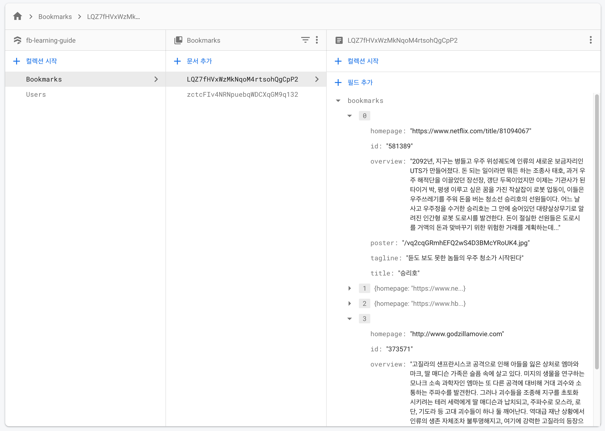

# 학습 주제

3월 31일 학습 시간에 다룰 주제입니다.

- [x] Firebase 리마인드
- [x] Firestore 시작하기
- [x] Firestore 용어 및 개념 정리
- [x] Firebase 인증 유티릴티 작성
- [x] 회원가입(이메일/패스워드 인증)
- [x] 랜덤 아바타 설정
- [x] 로그인(이메일/패스워드 인증)
- [x] RouteGuard 컴포넌트
- [x] Bookmarks 컬렉션
- [x] 북마크 추가, 제거, 가져오기 유틸리티 작성

<br>

# Firebase 리마인드

Firebase 구성 및 인증 코드를 다시 살펴보며 학습한 내용을 되새겨 봅시다.

**src/api/firebase.js**

```js
import firebase from 'firebase/app'
import 'firebase/auth'
import 'firebase/firestore'

/* config ------------------------------------------------------------------- */

const {
  REACT_APP_FB_API_KEY,
  REACT_APP_FB_AUTH_DOMAIN,
  REACT_APP_FB_DB_URL,
  REACT_APP_FB_PROJECT_ID,
  REACT_APP_FB_STORAGE_BUCKET,
  REACT_APP_FB_MESSAGE_ID,
  REACT_APP_FB_APP_ID,
} = process.env

const config = {
  apiKey: REACT_APP_FB_API_KEY,
  authDomain: REACT_APP_FB_AUTH_DOMAIN,
  databaseURL: REACT_APP_FB_DB_URL,
  projectId: REACT_APP_FB_PROJECT_ID,
  storageBucket: REACT_APP_FB_STORAGE_BUCKET,
  messagingSenderId: REACT_APP_FB_MESSAGE_ID,
  appId: REACT_APP_FB_APP_ID,
}

/* initialization ----------------------------------------------------------- */

firebase.initializeApp(config)

/* export modules ----------------------------------------------------------- */

export const auth = firebase.auth()
export const firestore = firebase.firestore()

export default firebase

/* setting language --------------------------------------------------------- */

auth.languageCode = 'ko'

// 명시적으로 언어를 설정하는 대신, 브라우저의 기본 환경 설정을 적용할 수도 있습니다.
// auth.useDeviceLanguage()

/* setting persistence ------------------------------------------------------ */

// 로그인(인증) 상태 유지 설정 (LOCAL, SESSION, NONE)
// - 열린 세션(창)에서만 로그인 상태 유지
auth.setPersistence(firebase.auth.Auth.Persistence.SESSION)

// 인증 지속성 설정 유틸리티 함수
export const setAuthPersist = (value) => {
  let mode = ''
  switch (value) {
    default:
    case 'local':
      mode = 'LOCAL'
      break
    case 'session':
      mode = 'SESSION'
      break
    case 'none':
      mode = 'NONE'
  }

  auth.setPersistence(firebase.auth.Auth.Persistence[mode])
}

/* Google Auth Provider ----------------------------------------------------- */

const googleProvider = new firebase.auth.GoogleAuthProvider()
googleProvider.setCustomParameters({ prompt: 'select_account' })

// 로그인 유틸리티 함수
export const signInWithGoogle = () => auth.signInWithPopup(googleProvider)

// 로그아웃 유틸리티 함수
export const signOut = () => auth.signOut()
```

<br>

# Cloud Firestore

Firestore는 [NoSQL](https://ko.wikipedia.org/wiki/NoSQL) 클라우드 데이터베이스입니다. 클라이언트 사이드 개발에 사용되는 데이터를 저장하고 동기화할 수 있습니다.


"문서(Document)"는 데이터 정리와 쿼리에 사용할 수 있는 문서 컨테이너인 "컬렉션(Collection)"에 저장됩니다. 
SQL 데이터베이스와 달리 테이블이나 행이 없으며, 컬렉션으로 정리되는 문서에 "데이터(Data, Field)"를 저장합니다.

 
<br>

### 데이터베이스 구조

문서 내에 하위 컬렉션을 만들고 데이터베이스 증가에 따라 확장되는 계층적 데이터 구조를 만들 수도 있습니다.
일반적으로 문서를 간단한 JSON 객체로 취급해도 무방합니다. 우리는 실습에서 인증 사용자 관리를 위한 **Users** 컬렉션과 사용자의 북마크 관리를 위한 **Bookmarks** 컬렉션을 Firestore 데이터베이스에 만들 수 있습니다.



### 인증 및 데이터 요청/응답

"나의 영화" 북마크 서비스는 사용자 인증 후, 사용자의 고유 ID(`uid`)와 일치하는 북마크 데이터를 Firestore에 요청하여 응답 받습니다.


<br>

## Firestore 데이터베이스 시작하기

Firebase 프로젝트에 Firestore 데이터베이스를 사용할 수 있도록 설정합니다. ([Cloud Firestore 데이터베이스 만들기](https://firebase.google.com/docs/firestore/quickstart?authuser=1#create) 문서 참고)

<br>

## 컬렉션 / 문서 참조란? 🤔

Firestore의 모든 문서(Documents)는 데이터베이스 안에서의 "**위치**"에 따라 **고유하게 식별**됩니다.
이 위치를 "**참조**"하려면 위치를 가리키는 "**참조 객체**"를 만들어야 합니다. 즉, 참조란? **데이터베이스의 특정 위치를 가리키는 객체**를 말합니다.

예를 들어 Users 컬렉션 참조를 통해 인증 사용자의 고유 ID(`uid`)로부터 "사용자 문서 참조"를 만들 수 있습니다. <u>해당 위치에 데이터가 있는지 여부에 관계없이 참조를 만들 수 있으며, 참조를 만들어도 네트워크 작업이 수행되지 않습니다.</u>

```js
// firestore 객체의 collection 메서드를 사용해 Users 컬렉션 참조 객체 생성
const usersCollectionRef = firestore.collection('Users')

// usersCollectionRef 컬렉션 참조를 통해 인증 사용자 문서 참조 객체 생성
const userDocumentRef = usersCollectionRef.doc(auth.currentUser.uid)
```

참조 객체는 편의상 슬래시(`/`)로 구분한 문자열로 컬렉션 또는 문서의 경로(path)를 지정해 만들 수도 있습니다.

```js
// Users 컬렉션 → 인증 사용자 UID 위치를 참조하는 "문서 참조 객체" 생성
const userDocumentRef = firestore.doc(`Users/${auth.currentUser.uid}`)
```

<br>

## 참조, 스냅샷? 🤔 

Firestore는 "**참조(references)**"와 "**스냅샷(snapshots)**"이라는 2가지 유형의 객체를 반환합니다. 이러한 객체는 컬렉션 또는 문서 각 유형마다 존재합니다. <u>쿼리 요청 응답이 아무 것도 존재하지 않더라도 Firestore는 항상 이러한 객체를 반환합니다.</u>


"쿼리 참조"(`QueryReference`) 또는 "쿼리 스냅샷"(`QuerySnapshot`)은 데이터베이스에 정보 처리(요청/응답)를 위해 필요한 객체입니다. 쿼리 참조 객체는 "쿼리하는 데이터베이스의 현재 위치를 나타내는 객체"입니다. 다음 중 한가지 방법을 사용해 요청합니다.

```jsx
// 컬렉션 참조 객체
firestore.collection('Users');

// 문서 참조 객체
firestore.doc(`Users/${auth.currentUser.uid}`);
```

쿼리 객체(컬렉션 또는 문서 참조)는 <u>실제 데이터베이스 자료가 아닙니다.</u> 하지만 데이터베이스의 세부사항을 알려 줄 속성(`id`, `parent`, `path` 등)을 가지고 있습니다. 쿼리 객체를 통해 원하는 데이터의 스냅샷 객체를 가져올 수 있습니다.


<br>

## 컬렉션 참조? 문서 참조? 🤔 

컬렉션 참조(`collectionRef`)를 사용해 컬렉션에 새로운 문서를 추가(`add` 메서드 사용) 할 수도 있고,
문서 참조(`documentRef`)는 데이터를 읽고, 쓰고, 수정하고, 지울 수 있는 메서드(`set`, `get`, `update`, `delete`)를 사용해 Firestore 데이터베이스에 CRUD를 요청할 수 있습니다.

<br>

참조 유형 | 메서드 | 설명
--- | --- | ---
컬렉션(`collectionRef`) | `add` | 컬렉션 안에 문서 추가 요청
문서(`documentRef`) | `set`, `get`, `update`, `delete` | CRUD 요청

<br>

컬렉션 또는 문서 참조 객체를 통해 스냅샷 객체를 가져올 수 있습니다. (`get` 메서드 사용)

참조 유형 | 설명
--- | ---
컬렉션(`collectionRef`) | 쿼리 스냅샷(`querySnapshot`) 객체 반환
문서(`documentRef`) | 문서 스냅샷(`documentSnapshot`) 객체 반환

<br>

쉽게 말해 다음의 코드로 참조 객체를 통해 데이터베이스의 스냅샷을 가져올 수 있습니다.

```js
// 컬렉션 참조 → 쿼리 스냅샷
const querySnapshot = collectionRef.get()

// 문서 참조 → 문서 스냅샷
const documentSnapshot = documentRef.get()
```

<br>

## 쿼리 스냅샷 🤔 

컬렉션 참조(`collectionRef`) 객체에서 쿼리 스냅샷(`querySnapshot`) 객체를 가져올 수 있습니다.

```js
// 컬렉션 참조 객체
const collectionRef = firestore.collection(`Users`)

// 쿼리 스냅샷 객체
const querySnapshot = collectionRef.get()
```

쿼리 스냅샷 객체의 `.empty` 속성을 사용해 <u>컬랙션 안에 문서가 있는지 확인</u>할 수 있습니다.

```js
// 데이터베이스 컬렉션 안에 문서가 없다면...
if (querySnapshot.empty) {
  // ...
}
```

그리고 `.docs` 속성을 사용하면 컬렉션의 모든 문서를 가져올 수 있으며, 
문서 스냅샷 객체를 "배열" 유형으로 반환합니다.

```js
// 문서 스냅샷 배열(documentSnapshot[]) 반환
const allDocumentsArray = querySnapshot.docs

// 포함하는 문서 스냅샷 객체의 총 개수 반환
const allDocumentsArraySize = querySnapshot.size

// 포함하는 모든 문서 스냅샷의 데이터 출력
const allDocumentsData = allDocumentsArray.map(doc => doc.data())
```

<br>

## 문서 스냅샷 🤔

문서 참조(`documentRef`) 객체에서 문서 스냅샷(`documentSnapshot`) 객체를 가져올 수 있습니다.

```js
// 문서 참조 객체
const docRef = firestore.doc(`Users/${user.uid}`)

// 문서 스냅샷 객체
const docSnapshot = docRef.get()
```

문서 스냅샷 객체의 `.exists` 속성을 통해 <u>해당 문서가 데이터베이스에 있는 지 확인</u>할 수 있습니다.

```js
// 데이터베이스에 문서 참조가 없으면...
if (!docSnapshot.exists) {
  // ...
}
```

그리고 `.data()` 메서드를 호출해 실제 데이터 값을 가져올 수 있습니다. 이 메서드는 문서 데이터(JSON) 객체를 반환합니다.

```js
docSnapshot.data() // 데이터(JSON) 객체
```

<br>

## 실시간 업데이트 🤔

`onSnapshot()` 메서드를 사용하면 문서 참조 객체의 변경 사항을 실시간으로 관찰하여 변경사항 발생 즉시 UI를 업데이트 할 수 있습니다. 최초 호출 과정에서 문서 스냅샷 객체가 바로 생성되고, [콘텐츠가 변경될 때마다 콜백 호출되어 문서 스냅샷 객체를 업데이트 합니다.](https://firebase.google.com/docs/firestore/query-data/listen)

```js
// 사용자 북마크 참조 객체
const userBookmarkRef = firestore.doc(`Bookmarks/${auth.currentUser.uid}`)

// 사용자 북마크 참조 객체의 스냅샷 실시간 변경 추적 (이벤트 연결)
// 이벤트 취소 함수 반환 (cleanup 과정에서 사용 됨)
const unsubscrbe = userBookmarkRef.onSnapshot(
  // 변경이 발생할 때마다 콜백 실행 (실시간 업데이트)
  (snapshot) => {
    console.log('문서 스냅샷 ID: ', snapshot.id)
    console.log('문서 스냅샷 데이터: ', snapshot.data())
  }, 
  // 오류 발생 시 처리
  (error) => {
    console.log('오류 발생: ', error.message);
  }
)
```

`React.useEffect()` 훅 안에서 `onSnapshot()` 이벤트를 문서 참조 객체에 연결한 후, 클린업(cleanup) 함수 안에서 연결된 이벤트를 해제하지 않으면 오류 메시지가 출력됩니다.


<br>

## 데이터 유형

Firestore는 일반적인 `string`, `number`, `boolean`, `null` 뿐만 아니라, 아래와 같은 데이터 유형을 지원합니다. ([참고](https://firebase.google.com/docs/firestore/manage-data/data-types))


<br>
<br>

유형 | 설명(참고)
-- | --
map | JavaScript 객체라고 생각하세요.
array | 배열 안에 다른 배열을 포함할 수 없음에 주의하세요.
timestamp | 날짜, 시간을 나타내는 타임 스탬프입니다.
geopoint | 위도, 경도 정보를 나타내는 지리 좌표입니다.
reference | 문서 경로 정보입니다.

<br>

## 데이터 구조화

Firestore에 저장할 데이터 구조를 잘 설계해야 관리가 용이합니다.
자세한 사항은 [데이터 구조 선택](https://firebase.google.com/docs/firestore/manage-data/structure-data?authuser=1) 문서를 참고해봅시다.

구조 | 설명
--- | ---
문서의 중첩 데이터 | 문서 안에 단순한 고정 데이터 목록을 보관하려는 경우 데이터 구조를 손쉽게 설정하고 간소화할 수 있습니다.
하위 컬렉션 | 데이터가 시간에 따라 증가할 가능성이 있다면 문서 내에 컬렉션을 만들 수 있습니다.
루트 수준 컬렉션 | 다대다 관계에 적합하며 각 컬렉션 내에서 강력한 쿼리를 제공합니다.

### 문서의 중첩 데이터

문서 안에 단순한 고정 데이터 목록을 보관하려는 경우 데이터 구조를 손쉽게 설정하고 간소화할 수 있습니다. 하지만 시간에 따라 데이터가 증가하는 경우 다른 옵션보다 확장성이 부족합니다. 목록이 커지면 문서도 커지므로 문서 검색 속도가 느려질 수 있습니다.


### 하위 컬렉션

목록이 커져도 상위 문서의 크기는 그대로입니다. 또한 하위 컬렉션에서 모든 쿼리 기능을 사용할 수 있으며 하위 컬렉션 간에 컬렉션 그룹 쿼리를 실행할 수 있습니다. 하지만 하위 컬렉션을 손쉽게 삭제할 수 없습니다.


### 루트 수준 컬렉션

루트 수준 컬렉션은 다대다 관계에 적합하며 각 컬렉션 내에서 강력한 쿼리를 제공합니다. 하지만 
데이터베이스가 커지면 내재적으로 계층 구조를 가진 데이터 가져오기가 더욱 복잡해질 수 있습니다.


<br>

다시 한 번 실습에 활용된 데이터 구조를 살펴보면 "루트 수준 컬렉션"을 그린 것을 알 수 있을 겁니다.


<br>

## 문서 CRUD

Firestore 데이터베이스의 문서를 읽거나, 쓰거나, 수정하거나, 제거하는 방법을 간단히 정리해봅니다.

<br>

### 데이터 읽기 (GET)

Firestore에 추가한 데이터를 빠르게 확인하려면 데이터 뷰어를 사용합니다.
`get` 메서드를 사용해 전체 컬렉션을 가져올 수 있습니다.

```js
// 컬렉션 참조 객체의 스냅샷 가져오기
const snapshot = collectionRef.get()

// 스냅샷이 존재할 경우
if (snapshot.exists) {
  // 포함하는 모든 문서의 ID, 데이터 출력
  snapshot.forEach(doc => console.log(doc.id, doc.data()))
}
```

<br>

### 데이터 쓰기 (SET)

컬렉션 문서에 데이터를 저장하려면 `set` 메서드를 사용합니다.

```js
// 인증 사용자의 정보 추출
const { uid, displayName, email, photoURL } = auth.currentUser
// 생성일자
const createdAt = new Date()
// 추가 데이터
const additionalData = { /* ... */ }

// 인증 사용자 문서 참조 객체 생성
const userRef = firestore.doc(`Users/${uid}`)

// 문서 참조 객체의 set 메서드를 통해 데이터베이스 쓰기 요청
userRef.set({
  displayName,
  email,
  photoURL,
  createdAt,
  ...additionalData
})
```

<br>

### 데이터 수정 (UPDATE)

문서 전체를 덮어쓰지 않고 일부 필드(field)를 업데이트하려면 `update` 메서드를 사용합니다.

```js
userRef.update({
  // 수정하려는 특정 필드 `키:값`을 입력
  displayName: '최신상',
  email: 'choisinsang@dev.io'
})
```

중첩된 데이터(객체) 필드를 수정할 경우에는 "점(`.`) 표기법"을 사용합니다.

```js
// 데이터베이스 문서 (예시)
const userRefData = {
  uid: 'fjwkjicjscsdfq23d',
  displayName: '',
  email: '',
  // ...
  bookmarks: {
    '399566': {
      title: '...',
      tagline: '...',
      // ...
    }
  }
}

// 인증 사용자 문서 참조 객체
const userRef = firebase.doc(`Users/${auth.currentUser.uid}`)

// 사용자 문서 참조 객체의 update 메서드를 사용해 subjects.subject 값 수정
userRef.update({
  `subjects.${subject.id}`: {/* 수정 할 데이터 ... */}
})
```

<br>

### 데이터 삭제 (DELETE)

문서를 삭제하려면 `delete` 메서드를 사용합니다.

```js
// 사용자 인증 문서 참조 객체의 delete 메서드를 사용해 제거
userRef.delete()
```

<br>

## 보안 규칙

Firestore [보안 규칙](https://firebase.google.com/docs/firestore/security/rules-structure?authuser=1)에 따라 데이터를 읽거나, 쓸 수 있도록 설정할 수 있습니다. ([참고](https://firebase.google.com/docs/firestore/security/rules-structure))

<details>
  <summary>읽기/쓰기 모두 허용 안함</summary>
  <br>

  ```js
  rules_version = '2';
  service cloud.firestore {
    // 데이터베이스 규칙
    match /databases/{database}/documents {
      match /{document=**} {
        allow read, write: if false;
      }
    }
  }
  ```
</details>

<br>

<details>
  <summary>읽기/쓰기 모두 허용</summary>
  <br>
  
  ```js
  rules_version = '2';
  service cloud.firestore {
    // 데이터베이스 규칙
    match /databases/{database}/documents {
      match /{document=**} {
        allow read, write: if true;
      }
    }
  }
  ```
</details>

<br>

<details>
  <summary>특정 컬렉션 별, 읽기/쓰기 설정</summary>
  <br>
  
  ```js
  rules_version = '2';
  service cloud.firestore {
    // 데이터베이스 규칙
    match /databases/{database}/documents {
      // 특정 컬렉션이 매칭될 경우 
      // Users
      match /Users/{userId} {
        // 요청 uid 값을 가진 사용자 `생성`, `읽기` 허용
        allow create, read: if request.auth.uid != null;
        // 요청 uid 값과 userId 값이 일치할 경우 `수정` 허용
        allow write: if request.auth.uid == userId;
      } 
    }
  }
  ```
</details>

<br>


<br>

## Firestore 유틸리티 함수

앞서 학습한 개념을 정리하고, 앱에서 사용될 Firestore 유틸리티 함수를 작성해봅니다.

### 인증 사용자 문서 생성 및 가져오기 유틸리티

사용자가 인증하면 인증 정보를 토대로 Firestore 데이터베이스의 Users 컬렉션에 사용자 프로필(문서)을 저장하거나, 가져오는 유틸리티 함수를 만들어봅니다.
데이터베이스에 사용자 고유 ID와 일치하는 문서가 있을 경우 저장된 값을 반환하고 그렇지 않은 경우는 데이터를 저장합니다.

```js
// 인증 사용자 문서 생성 및 가져오기 유틸리티 (비동기 함수)
export const createOrGetAuthUser = async (user, additionalData = {}) => {
  // 사용자 정보가 전달되지 않으면 오류
  if (!user) {
    throw new Error('createOrGetAuthUser 유틸리티는 user 값 입력이 필요합니다.')
  }

  // 인증 사용자 문서 참조 생성
  const userRef = firestore.doc(`Users/${user.uid}`)
  // 인증 사용자 문서 스냅샷 가져오기 (비동기 요청/응답)
  const snapshot = await userRef.get()

  // 스냅샷이 없을 경우
  if (!snapshot.exists) {
    try {
      // 인증 사용자 정보 추출
      const { uid, displayName, email, photoURL } = user
      // 생성일자 생성
      const createdAt = new Date()

      // 데이터베이스에 인증 사용자 데이터 쓰기
      await userRef.set({
        uid,
        displayName,
        email,
        photoURL,
        createdAt,
        // 추가 데이터가 전달된 경우 병합(믹스인)
        ...additionalData,
      })
    } catch (error) {
      throw new Error(error.mesage)
    }
  }

  // 인증 사용자 문서 참조 객체 반환
  return userRef
}
```

<br>

## 이메일/패스워드 회원가입

회원가입 폼을 통해 입력 받은 사용자의 이메일, 패스워드 정보를 Firebase 인증 서비스에 전달해 새로운 인증 사용자를 추가해봅니다.

### 이메일/패스워드 회원가입 인증 유틸리티

회원가입 폼으로부터 전달 받은 `email`, `password` 값과 사용자 정보 `displayName`, `photoURL` 값을 병합해 Firebase 인증 서비스에 요청 처리하는 유틸리티 함수를 작성해봅니다.

```js
// 이메일/패스워드 회원가입 유틸리티 (비동기 함수)
export const signUpWithEmailAndPassword = async (
  email,
  password,
  additionalData = {}
) => {
  try {
    // 사용자가 입력한 이메일, 패스워드를 전달해 인증 (비동기 요청/응답)
    const { user } = await auth.createUserWithEmailAndPassword(email, password)
    // 인증 사용자 문서 생성 또는 가져오기 유틸리티를 사용해 인증 사용자 문서 참조 반환
    // 사용자 이름(displayName), 아바타(photoURL) 정보를 추가로 전달 받음
    return await createOrGetAuthUser(user, additionalData)
  } catch (error) {
    throw new Error(error.message)
  }
}
```

<br>

## 랜덤 아바타 생성

[getavataaars.com](https://getavataaars.com/) 온라인 서비스에 사용되는 [random-avatar-generator](https://github.com/maiconfriedel/random-avatar-generator) 패키지를 활용해 이메일/패스워드를 사용해 가입하는 신규 사용자의 아바타를 랜덤으로 설정할 수 있습니다.

```sh
npm i random-avatar-generator
```

사용법은 간단합니다. AvatarGenerator 클래스 모듈을 불러온 후, 생성하면 랜덤 아바타 URL이 반환됩니다.

```jsx
import { AvatarGenerator } from 'random-avatar-generator'

const generator = new AvatarGenerator()

// 랜덤 아바타 생성
generator.generateRandomAvatar()
```

옵션 값으로 시드(seed)를 전달하면 항상 동일한 아바타 URL을 반환합니다. `

```js
// [옵션] 
// 아바타의 시드(seed)를 설정할 수 있습니다. (항상 사용자 ID에 대해 동일한 아바타를 가져옵니다.)
// 예를 들어 'avatar' 시드는 항상 다음의 랜덤 아바타를 반환합니다. 
// https://avataaars.io/?accessoriesType=Kurt&avatarStyle=Circle&clotheColor=Blue01&clotheType=Hoodie&eyeType=EyeRoll&eyebrowType=RaisedExcitedNatural&facialHairColor=Blonde&facialHairType=BeardMagestic&hairColor=Black&hatColor=White&mouthType=Sad&skinColor=Yellow&topType=ShortHairShortWaved
generator.generateRandomAvatar('avatar'); 
```

<br>

### 회원가입 요청 이벤트 리스너

Navigation 컴포넌트의 회원가입 폼 전송 이벤트에 연결할 이벤트 리스너를 작성합니다.

```js
const handleSignUpSubmit = async (formdata) => {
  // 사용자 입력 폼 데이터 추출
  const { displayName, email, password } = Object.fromEntries(formdata.entries())

  // 이메일/패스워드 회원가입 유틸리티를 사용해 Firebase 인증 (비동기 요청/응답)
  await signUpWithEmailAndPassword(email, password, {
    displayName,
    // 랜덤 아바타 설정 (displayName을 seed로 추가하면 항상 동일한 아바타 URL 값 반환)
    photoURL: generator.generateRandomAvatar(displayName),
  })

  // 응답이 성공하면 다이얼로그 닫음(감춤, 제거)
  hideDialog()
}
```

랜덤 아바타가 성공적으로 생성되면 UI에 다음과 같이 멋지게 표시됩니다. 😄


랜덤 아바타 URL 값은 Firestore의 Users 컬렉션 `photoURL` 필드에 저장됩니다. 😎


<br>
<br>

## 이메일/패스워드 로그인

로그인 폼을 통해 입력 받은 사용자의 이메일, 패스워드 정보를 Firebase 인증 서비스에 전달해 인증 사용자 정보를 가져오도록 설정합니다.

### 이메일/패스워드 로그인 유틸리티

로그인 폼으로부터 전달 받은 `email`, `password` 값을 통해 Firebase 인증 서비스 요청 처리하는 유틸리티 함수를 작성해봅니다.

```js
// 이메일/패스워드 로그인 유틸리티 (비동기 함수)
export const signInWithEmailAndPassword = async (email, password) => {
  try {
    // 전달 받은 email, password 값을 전달해 Firebase 인증 (비동기 요청/응답)
    const { user } = await auth.signInWithEmailAndPassword(email, password)
    // 인증 사용자 문서 생성 또는 가져오기 유틸리티를 사용해 인증 사용자 문서 참조 반환
    // 사용자 이름(displayName), 아바타(photoURL) 정보를 추가로 전달 받음
    return await createOrGetAuthUser(user)
  } catch (error) {
    throw new Error(error.message)
  }
}
```

<br>

## RouteGuard 컴포넌트

로그인을 하지 않으면 북마크 페이지로 이동하는 링크가 표시되지는 않지만, 사용자가 직접 URL을 입력하면 접근 가능합니다. 이처럼 인증되지 않은 사용자가 볼 수 없는 페이지 접근을 차단하기 위해서는 인증 유무를 파악해서 페이지 이동 여부를 결정하도록 설정해야 합니다.

인증되지 않은 사용자에게 허용되지 않는 루트(route) 이동을 보호(guard)하기 위해 RouteGuard 컴포넌트를 만들어 사용해봅시다.

```jsx
import { Redirect, Route } from 'react-router-dom'
import { auth } from 'api/firebase'

export default function RouteGuard(props) {
  if (auth.currentUser) {
    return <Route {...props} />
  } else {
    return <Redirect to="/you-need-sign-in" />
  }
}
```

> **NOTE**  
> RouteGuard 이름은 임의로 만든 것이므로 공식 명칭이 아니며 ProtectedRoute, OnlyAuthRoute 등 다른 이름도 사용 가능합니다.

<br>

일반 Route 컴포넌트와 달리, RouteGuard 컴폰넌트는 <u>인증되지 않은 사용자의 접근으로부터 루트를 보호</u>합니다.

```jsx
<RouteGuard path="/bookmarks" component={BookmarkPage} />
```

<br>

## 북마크 컬렉션

사용자 인증 관리가 마무리 되었으니 이어서 북마크 컬렉션을 관리하는 실습을 진행합니다.


Bookmarks 컬렉션의 북마크 문서는 사용자 고유 ID를 타이틀(이름)로 하며, `bookmarks` 필드에 배열 데이터 유형으로 관리됩니다.


> **NOTE**  
> 데이터 구조 방식에 따라 컬렉션, 문서 구조는 달라질 수 있습니다. 실습에서는 "루트 수준 컬렉션"을 사용합니다.

<br>

## Firestore 유틸리티 함수

북마크를 CRUD 관리하기 위한 유틸리티 함수를 작성해봅니다.

<br>

### 북마크 쓰기

북마크 컬렉션, 문서를 생성하거나 또는 새로운 북마크를 추가하는 유틸리티 함수를 작성합니다. 이 유틸리티를 사용하면 별도로 Bookmarks 컬렉션, 문서를 Firestore에서 만들지 않아도 자동 생성합니다. ([배열 데이터 값 관리 방법](https://firebase.google.com/docs/firestore/manage-data/add-data?hl=ko#update_elements_in_an_array) 참고)

```js
// 인증 사용자 북마크 배열 생성 또는 아이템 추가 유틸리티 (비동기 함수)
export const createOrAddBookmarks = async (bookmark) => {
  // 북마크 정보가 전달되지 않으면 오류
  if (!bookmark) {
    throw new Error(
      'createOrAddBookmarks 유틸리티는 bookmark 인자 값 입력이 반드시 필요합니다.'
    )
  }

  // 인증 사용자 고유 ID(uid) 추출
  const {
    currentUser: { uid },
  } = auth

  // 인증 사용자 고유 ID가 없을 경우 오류 처리
  if (!uid) {
    throw new Error('인증 사용자가 아닙니다.')
  }

  // Bookmarks 컬렉션의 인증 사용자 북마크 문서 참조 객체 생성
  const userBookmarkRef = firestore.doc(`Bookmarks/${uid}`)

  try {
    // 인증 사용자의 북마크 문서 스냅샷 가져오기 (비동기 요청/응답)
    const userBookmarkSnapshot = await userBookmarkRef.get()

    // 인증 사용자 북마크 문서가 데이터베이스에 없을 경우
    if (!userBookmarkSnapshot.exists) {
      // 새로운 북마크 배열을 bookmarks 속성으로 추가한 후, bookmark 아이템을 첫번째 원소로 설정
      await userBookmarkRef.set({
        bookmarks: [bookmark],
      })
    }
    // 인증 사용자 북마크 문서가 데이터베이스에 있을 경우
    else {
      // 인증 사용자 북마크 문서 업데이트
      await userBookmarkRef.update({
        // bookmarks 속성에 참조된 배열 필드에 새로운 bookmark 아이템 추가
        bookmarks: firebase.firestore.FieldValue.arrayUnion(bookmark),
      })
    }
  } catch (error) {
    throw new Error(error.message)
  }

  // 인증 사용자 북마크 참조 객체 반환
  return userBookmarkRef
}
```

영화 상세 정보 페이지(MovieDetail.js)의 북마크 추가 버튼에 연결할 이벤트 리스너를 작성하고 유틸리티를 활용해 처리합니다.

```jsx
// 북마크 생성/추가 이벤트 핸들러
const handleAddBookmarks = async (newBookmark) => {
  try {
    // 생성 할 북마크
    await createOrAddBookmarks(newBookmark)
  } catch(error) {
    console.error(error.message)
  }

  addBookmark(newBookmark)
}


<BookmarkButton 
  onClick={() => handleAddBookmarks({
    id: match.params.id,
    title: json.title,
    tagline: json.tagline,
    overview: json.overview,
    poster: json.poster_path,
    homepage: json.homepage,
  })} 
/>
```

<br>

### 북마크 읽기

인증 사용자가 북마크 페이지에 진입하면 요청해 Firestore 데이터베이스에서 북마크 스냅샷을 가져오기 위한 유틸리티 함수를 작성합니다.

```js
// 인증 사용자 북마크를 가져오는 유틸리티 (비동기 함수)
export const getUserBookmarks = () => {
  // 인증 사용자 북마크 문서 참조 객체 반환
  // 외부에서 유틸리티 호출 후, onSnapshot()을 사용해 문서의 변경 사항을 실시간 업데이트 할 수 있음
  return firestore.doc(`Bookmarks/${auth.currentUser.uid}`)
}
```

북마크 페이지(Bookmark.js) 컴포넌트의 이펙트 훅에서 Firestore에 데이터를 요청하는 코드를 작성합니다.

```jsx
React.useEffect(() => {
  // 구독 취소 참조 변수
  let unsubscribe = null

  // 모든 북마크 가져오기 함수 함수
  const getBookmarks = async () => {
    // 사용자 북마크 참조 객체 생성
    const userBookmarkRef = getUserBookmarks()
    // 참조 객체에 onSnapshot() 이벤트를 연결, 변경사항(예: 추가/제거) 발생 시 실시간 UI 업데이트
    // 구독 취소 함수 반환 (클린업에서 사용 됨)
    unsubscribe = userBookmarkRef.onSnapshot((snapshot) => {
      if (snapshot.data) {
        // 응답받은 스냅샷을 통해 bookmarks 배열 데이터 추출
        const { bookmarks } = snapshot.data()
        // bookmarks 상태 업데이트 (React 리렌더링 → UI 업데이트)
        dispatch(writeAllBookmarkAction(bookmarks))
      }
    })
  }

  // 모든 북마크 가져오기 함수 실행
  getBookmarks()

  // 클린업 (구독 취소)
  return () => unsubscribe()
}, [])
```

<br>

### 북마크 삭제

북마크 컬렉션의 인증 사용자 문서에서 북마크 아이템을 삭제하는 유틸리티 함수를 작성합니다. ([배열 데이터 값 관리 방법](https://firebase.google.com/docs/firestore/manage-data/add-data?hl=ko#update_elements_in_an_array) 참고)


```js
// 인증 사용자 북마크 제거 유틸리티 (비동기 함수)
export const removeUserBookmark = async (bookmark) => {
  // 북마크 정보가 전달되지 않으면 오류
  if (!bookmark) {
    throw new Error('removeUserBookmark 유틸리티는 bookmark 인자 값 입력이 반드시 필요합니다.')
  }

  // 인증 사용자 정보 추출
  const { currentUser: { uid } } = auth

  // 인증 사용자 고유 ID가 없을 경우 오류 처리
  if (!uid) {
    throw new Error('인증 사용자가 아닙니다.')
  }

  // 북마크 컬렉션의 인증 사용자 북마크 문서 참조
  const userBookmarkRef = firestore.doc(`Bookmarks/${uid}`)

  try {
    // 인증 사용자의 북마크 문서 스냅샷 가져오기 (비동기 요청/응답)
    const userBookmarkSnapshot = await userBookmarkRef.get()

    // 인증 사용자 북마크 문서가 데이터베이스에 있을 경우
    if (userBookmarkSnapshot.exists) {
      // 북마크 배열에서 bookmark와 일치하는 아이템을 삭제 요청
      await userBookmarkRef.update({
        bookmarks: firebase.firestore.FieldValue.arrayRemove(bookmark),
      })
    }
  } catch(error) {
    console.error(error.message)
  }

  // 인증 사용자 북마크 참조 객체 반환
  return userBookmarkRef
}
```

북마크(Bookmark.js) 페이지 컴포넌트의 북마크 제거 버튼을 사용자가 클릭하면 삭제를 요청할 수 있도록 코드를 작성합니다.

```jsx
<Bookmark.Button
  onClick={async () => {
    // 삭제할 북마크 객체
    const removeBookmark = {
      id,
      poster,
      title,
      tagline,
      overview,
      homepage,
    }
    // Firestore에 북마크 삭제 (비동기 요청/응답) 
    await removeUserBookmarksInColletion(removeBookmark)
    
    // Redux 디스패치 (상태 업데이트)
    handleRemoveBookmark(removeBookmark)
  }}
/>
```

<br>

## 작성한 코드가 작동은 잘 되지만...

현재 작성된 코드는 Firestore 요청, Redux 디스패치 요청이 따로 따로 놀고 있는 느낌이죠?
원인은 Firestore의 처리 방식(비동기 요청/응답)과 Redux의 처리 방식(동기)이 다르기 때문입니다. 이 문제는 내일 수업에서 [Redux Thunk](https://www.npmjs.com/package/redux-thunk) 미들웨어를 추가하여 하는 실습을 진행할 것입니다. 

<br>

